# MADRE — Mid-Level Architecture

This document translates the Product and Owner Intent Corpus into engineering boundaries.

It is intentionally **mid-level**: concrete enough to constrain implementation and explain the complete system, while avoiding speculative private classes, persistence technology, transport details or exhaustive Operation catalogues.

Normative SPIRA semantics are in `docs/architecture/security-algebra.md`.

Two rules govern this architecture:

> Assign ownership only where MADRE actually needs ownership. Preserve intrinsic composition as composition rather than creating managers for relations.

> Keep public contracts explicit enough that an independent human or AI builder can implement a Module without private MADRE knowledge.

## 1. System concerns

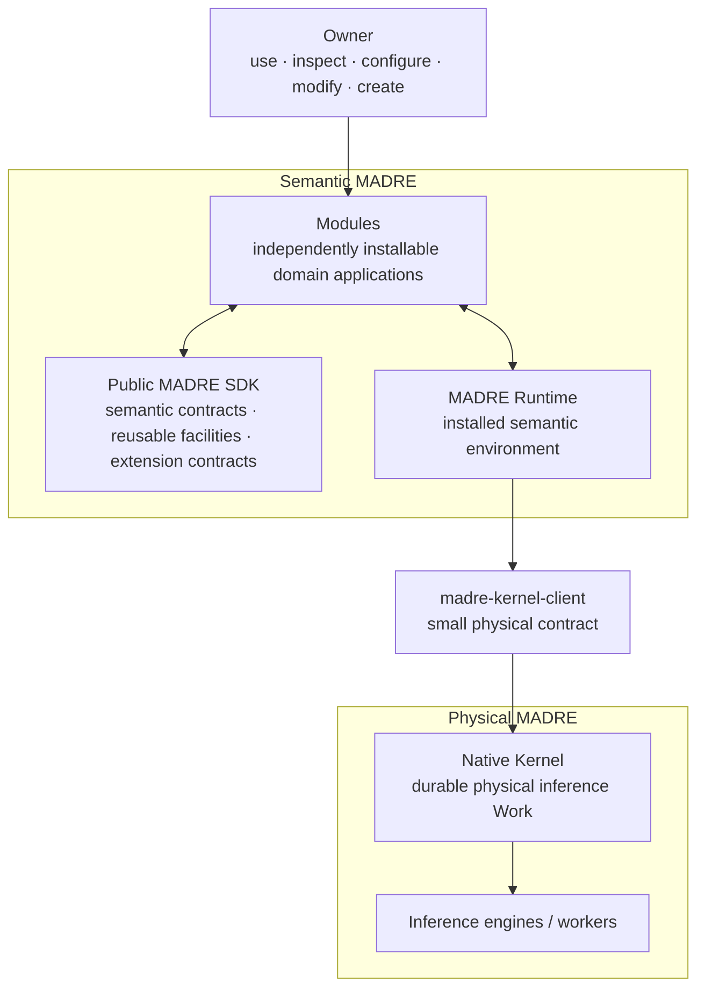

These are not equivalent services.

- **Modules** contain application/domain meaning.
- **SDK** is the public construction vocabulary shared by shipped, independent and generated software.
- **Runtime** supplies the installed environment: Module lifecycle/discovery/routing plus shared semantic execution mechanics.
- **Kernel client** is a small physical boundary artifact.
- **Kernel** owns already-physical inference Work.
- **engines/workers** perform physical inference.

A Module may privately use another AI/inference environment without using the shared Kernel. Kernel is not a universal interceptor.

## 2. Module boundary

A Module is an independently installable application/domain semantic boundary.

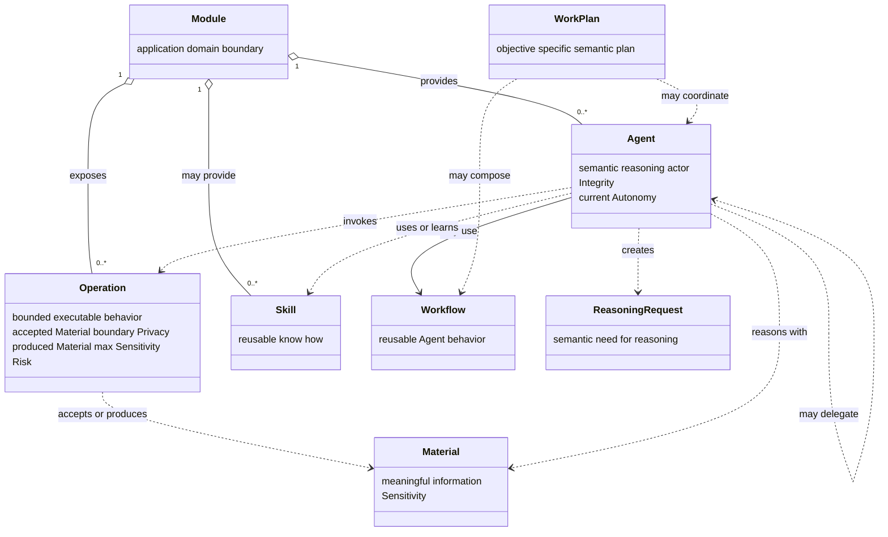

This is a semantic contract model, not a requirement for one Java class per box.

A Module may internally own domain state, persistence, UI, integrations, private intelligence and any implementation its application needs. Only the public semantic surface matters to MADRE composition.

A Module may be agentless, UI-less, very small, or a thin binding around existing software.

## 3. Agent and Operation are actor and action

An Agent is the semantic actor. An Operation is one bounded action the actor can perform.

A Module can expose Operations without providing an Agent. Another Agent can invoke them.

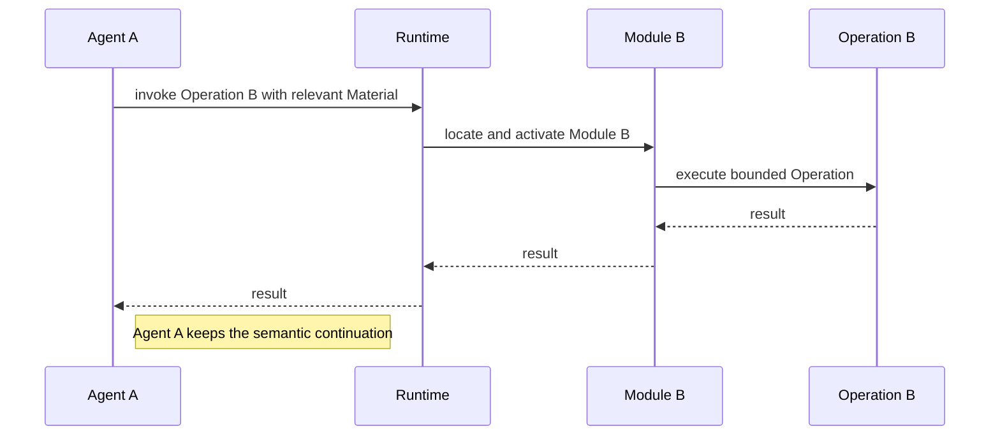

Runtime transports and activates. It does not become the actor merely because it routes the call.

An explicit Agent delegation is different:

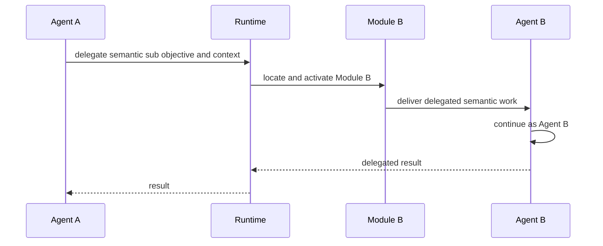

The distinction is fundamental:

```text
Operation invocation -> another bounded action is used; initiating Agent keeps the continuation
Agent delegation     -> another Agent receives delegated semantic continuation
```

A WorkPlan may coordinate multiple Agents and Workflows, but it is semantic planning rather than Runtime scheduling or Kernel Work.

## 4. SPIRA direct carriers

SPIRA is not one universal security context. Each facet comes from the semantic fact where it actually has meaning.

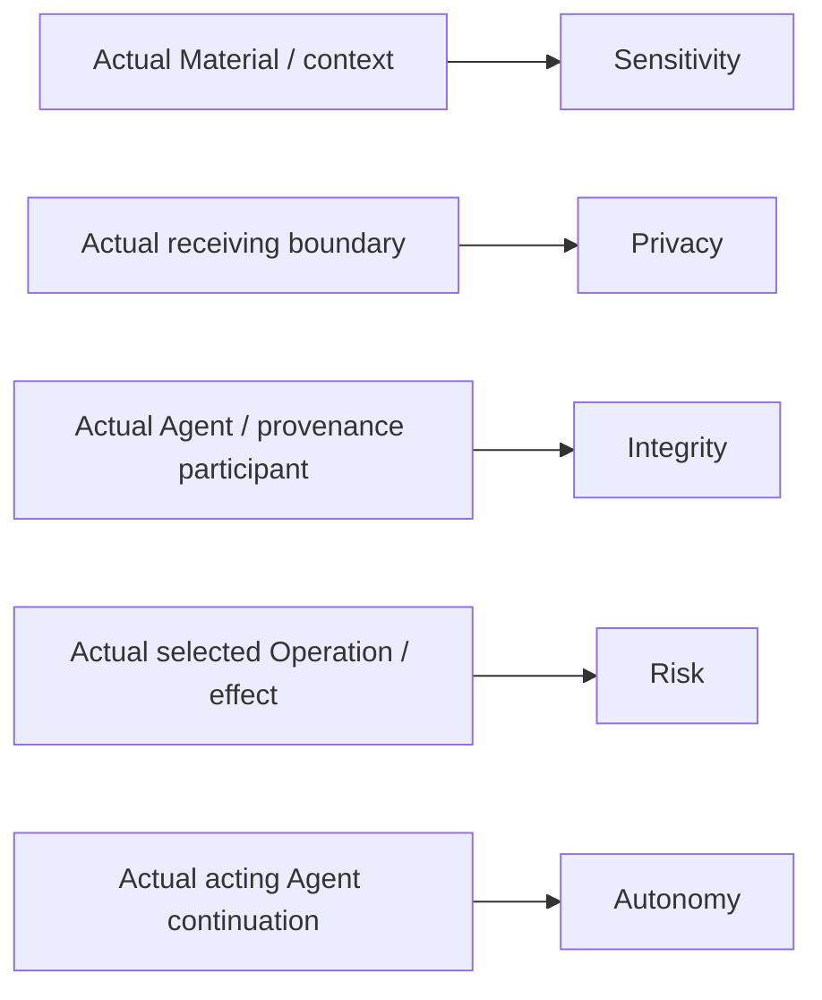

Current values are:

| Facet | 0 | 1 | 2 | 3 | 4 | 5 |
| --- | --- | --- | --- | --- | --- | --- |
| Sensitivity | SYSTEM_RESERVED | TRIVIAL | SHARED | PROFILING | SENSITIVE | SECRET |
| Privacy | SYSTEM_RESERVED | PUBLIC | UNKNOWN | LOCAL | MODULE | ISOLATED |
| Integrity | SYSTEM_RESERVED | NOT_DECLARED | DECLARED | TRUSTED | ACCEPTED | VALIDATED |
| Risk | SYSTEM_RESERVED | READ | WRITE | DELETE | EXECUTE | POTENTIALLY_HARMFUL |
| Autonomy | SYSTEM_RESERVED | LIVE_INTERACTION | ASK_ALWAYS | ASK_ONCE | ACKNOWLEDGE | AUTONOMOUS |

Integrity means increasing assurance:

- `NOT_DECLARED`: cannot be traced or meaningfully claimed;
- `DECLARED`: manifested declaration without independent traceability;
- `TRUSTED`: established provenance, common use or other evidence despite incomplete analysis;
- `ACCEPTED`: stronger assurance from effective boundaries, known origin, observable behavior or direct Owner acceptance;
- `VALIDATED`: deterministically verifiable again when needed.

Same-facet reductions are:

```text
Sensitivity = max(actual participating Sensitivities)
Privacy     = min(actual participating Privacies)
Integrity   = min(actual participating Integrities)
```

Risk is the Risk of the actual selected Operation/effect. Autonomy is the Autonomy of the actual acting Agent continuation. They are not generic running aggregates.

There is no mandatory `EffectProfile` in the current architecture. Earlier implementation experiments paired Risk and Autonomy, but the settled model keeps them separate because they belong to different actual constituents.

## 5. Operation semantic surface

An Operation can expose the semantic facts necessary to compose with it before executing arbitrary implementation code.

Conceptually:

```text
Operation
    accepted Material type -> receiving Privacy
    produced Material type -> maximum promised Sensitivity
    concrete behavior/effect -> Risk
```

The exact Java representation is not fixed at this level.

Produced Material that promises a bounded maximum Sensitivity must honor that semantic contract. A Module can deliberately produce a new minimized/anonymized representation with lower Sensitivity, but that new representation is distinct from its source.

Derived summaries may be useful for discovery. For example, the Operations an Agent currently exposes can imply an effective Privacy and currently reachable Module information can imply an effective Sensitivity. These are views derived from the real constituents, not additional owners of the facet.

## 6. Intrinsic SPIRA compound

No Agent or Runtime component owns a mutable Compound object.

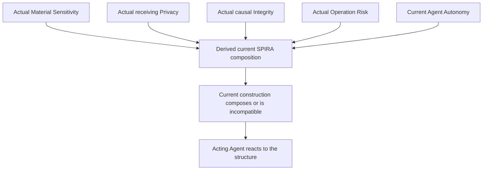

Only actual constituents contribute. Unused Operations, possible future results, installed capabilities and unrelated branches do not contaminate the current construction.

The Agent does not decide what the algebra should say. The Agent decides what to try. The SPIRA structure follows from the real semantic pieces of that attempt.

## 7. Where SPIRA facets meet

There is no global SPIRA score and no central evaluator object. Facets meet where a concrete semantic construction makes their relation relevant.

### Actual information entering an actual receiver

```text
max(S_actual_information) <= min(P_actual_receiving_boundaries)
```

A Material that is not sent does not participate. A destination considered but rejected does not contaminate another path.

### Actual Operation under the current Agent continuation

```text
min(R_actual_operation, A_current_agent_continuation)
    <= min(I_actual_non_user_causal_participants)
```

Owner interaction can alter the real Agent continuation and therefore Autonomy. It does not lower the Operation's Risk.

### Actual effect realization

Where effect realizers carry semantically relevant Integrity:

```text
R_actual_operation
    <= min(I_actual_effect_realizers)
```

A lower-Autonomy continuation does not make an unreliable high-consequence realization reliable.

These are intrinsic composition relations, not authorization or permission checks. A compatible current construction can continue; an incompatible exact construction cannot continue unchanged.

The Agent can change reality and derive again: choose another Operation/path, derive new Material, change continuation through Owner interaction, delegate, use another real participant, or stop.

## 8. Module-local semantic re-evaluation

Module boundaries are meaningful because Modules know their domains.

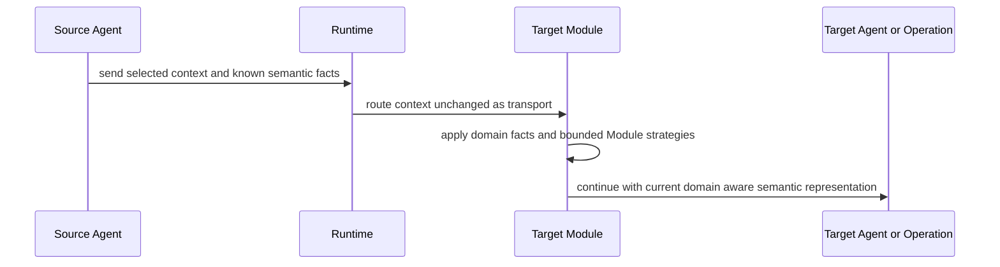

The target does not blindly inherit one eternally global sensitivity label, and it does not discard source knowledge. It can derive a different current representation or sensitivity where its domain knowledge justifies it.

If a domain strategy genuinely needs reasoning, an Agent creates a ReasoningRequest. SPIRA itself does not secretly call a model.

## 9. ReasoningRequest remains semantic

A ReasoningRequest is created by an Agent when reasoning is actually needed.

It may involve context, Material, provenance, Owner instruction, relevant SPIRA facts and the reasoning objective.

The architecture deliberately does **not** define a mandatory `ReasoningRequest.S/P/I/R/A` tuple.

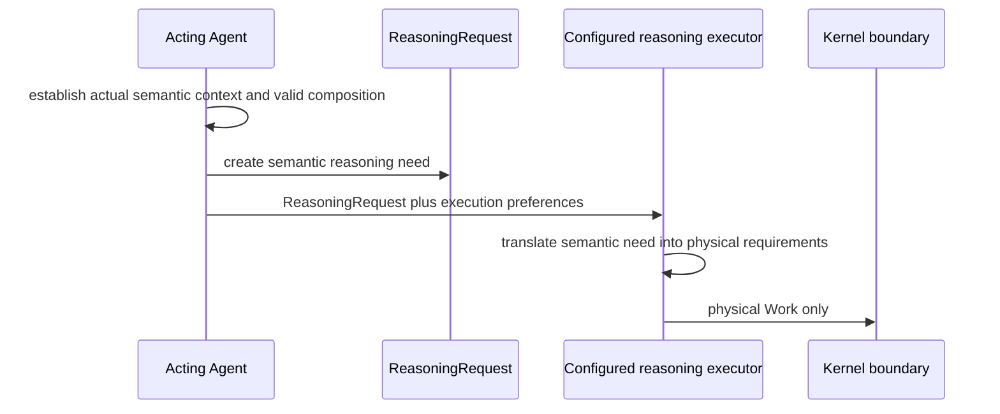

Risk remains with an actual Operation/effect. Autonomy remains with the current Agent continuation. Other facets remain with the actual objects/boundaries/provenance that contribute them.

The ReasoningRequest does not cross into Kernel as a semantic object.

## 10. Runtime responsibilities

Runtime is the installed semantic environment around Modules, SDK facilities and the physical Kernel boundary.

### Module environment

Runtime provides installation mechanics for:

- Module installation/configuration;
- CORE role assignment;
- live discovery of exposed Module surfaces;
- activation/lifecycle;
- addressing;
- routing cross-Module Operation calls;
- routing Agent delegation;
- Owner/runtime inspection and diagnostics.

Runtime provides the mechanics. It does not acquire the Module's domain meaning and does not become the evaluator of SPIRA.

### Shared reasoning execution

Runtime also provides installation mechanics for:

- receiving/executing the configured reasoning-to-physical function;
- persistence/correlation needed for delayed semantic reasoning;
- correlation between semantic requests and physical Kernel Work/results;
- continuation/recovery support.

The meaning of the reasoning remains in the responsible Agent/Module semantic process.

## 11. ReasoningRequest to physical Work is a Module-owned special Operation

Agents create `ReasoningRequest`s. They do **not** construct Kernel `WorkRequest`s directly.

The SDK defines a bounded required function:

```text
ReasoningRequest
+
execution preferences/declarations
        ↓
configured reasoning executor Operation
        ↓
physical WorkRequest
```

The preference/declaration object is intentionally not frozen at this level. It lets semantic code express computation effort, timing and other physical preferences without forcing Agents to understand Kernel mechanics.

This function follows ordinary MADRE modularity:

- Runtime executes it;
- its implementation belongs to a Module;
- the shipped CORE Module provides the default implementation;
- Runtime stores the installation-level selection;
- the Owner may replace, wrap or decorate the implementation.

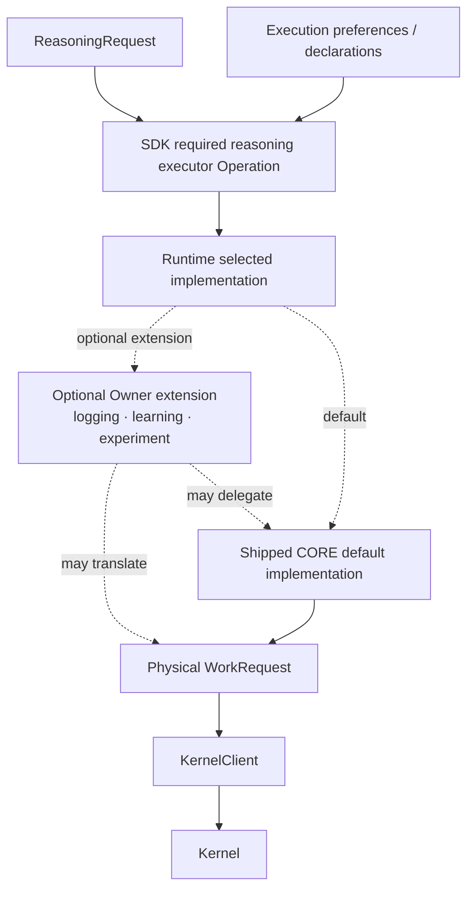

The selected implementation can inspect semantic facts available to the ReasoningRequest context and factual engine descriptions. It translates the chosen acceptable physical candidate space into physical Work constraints. SPIRA itself does not cross into Kernel.

## 12. Delayed Reasoning Effort

DRE spans semantic and physical persistence without collapsing them.

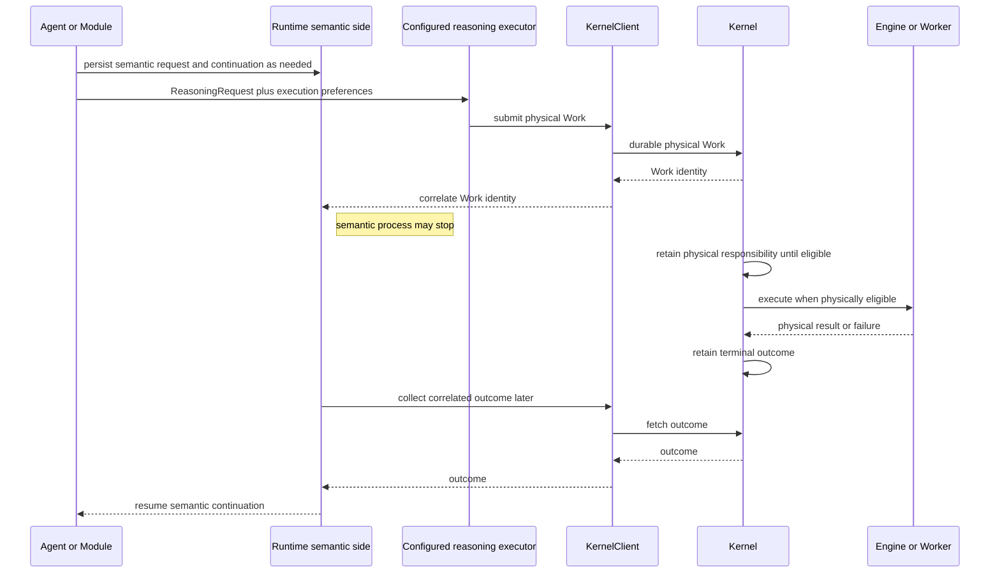

Semantic persistence may include the semantic request, relevant context, origin/correlation, continuation and interpretation state.

Kernel persistence contains only physical lifecycle: Work identity, technical requirements, eligibility/scheduling, attempts, resources, retry/cancel state and terminal result/failure.

Kernel correctness does not require Module or Runtime processes to remain alive while durable physical Work exists.

## 13. Kernel boundary

The Kernel is the native physical inference control plane.

It owns:

- durable physical Work;
- technical inference requirements;
- eligibility and scheduling;
- engine inventory and factual engine descriptors;
- technical matching;
- scarce-resource admission/accounting;
- worker lifecycle/supervision;
- physical retry/cancellation;
- attempts and technical failures;
- terminal physical results.

It must not know or persist:

```text
Module
Agent
Operation semantics
Material
ReasoningRequest
Sensitivity Privacy Integrity Risk Autonomy
CORE
Skill Workflow WorkPlan semantics
semantic continuation
semantic persistence
```

The Kernel may know physical facts such as engine location, provider/model identity where applicable, capabilities, resources, health and warm/loaded state. Semantic software can use those facts above the boundary to determine physical constraints.

Kernel does not convert physical locality/provider/model facts into Privacy or Integrity.

## 14. Kernel modularity without semantic leakage

MADRE's replaceability principle continues below the SDK boundary even though Kernel does not depend on the SDK.

Physical responsibilities should have bounded enough implementation seams that the Owner can replace or interpose experiments without rewriting the whole subsystem. Examples include another engine matcher, alternative resource admission, extra physical observability or learning-assisted physical routing that itself uses inference.

Such an experiment remains physical Kernel behavior. It reasons over physical facts and does not import Modules, Agents, Material or SPIRA into Kernel.

This does not require a speculative generic plugin framework now. It requires avoiding unnecessary closed implementation journeys.

## 15. CORE position

CORE is an ordinary Module assigned the CORE installation role.

The shipped default CORE may provide ordinary Owner interaction, default/meta behavior, default Agents, reusable general Operations/Skills, and the shipped default implementation of Runtime-required Module-owned Operations such as the reasoning executor.

CORE is not Runtime, Kernel, owner of other Modules, or a special SPIRA authority.

## 16. SDK as automated construction target

The public SDK must be sufficient for independent and eventually AI-generated Modules.


A generated Module must not require hidden first-party hooks, Runtime internals or Kernel internals. SPIRA is part of the public construction vocabulary so generated software can express its actual information, receiving-boundary, provenance, consequence and autonomy semantics without inventing another security architecture.

## 17. Logical dependency direction

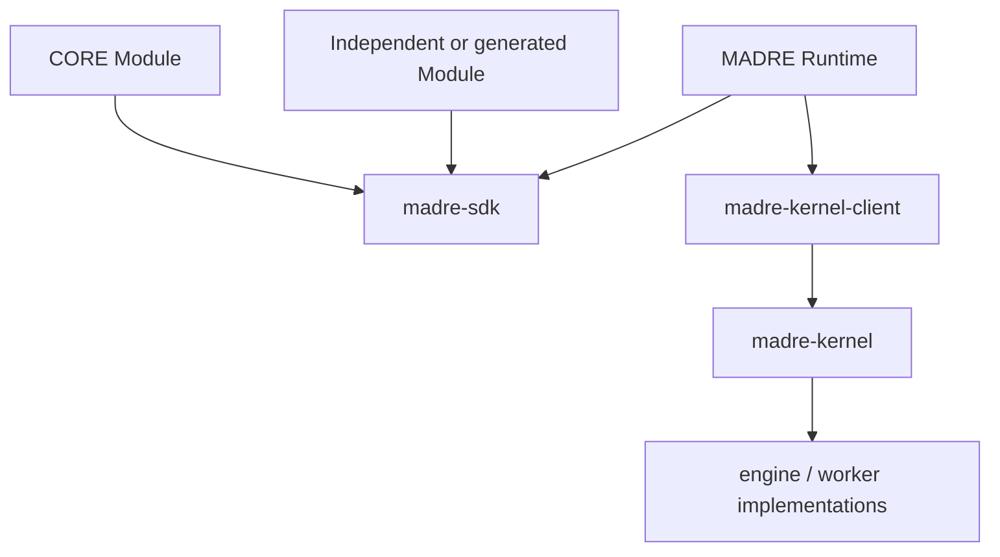

Hard dependency rules:

```text
madre-kernel-client  -X-> madre-sdk
madre-kernel         -X-> madre-sdk
madre-kernel         -X-> MADRE Runtime
```

A Module may privately use external AI or other systems without creating a Kernel dependency.

## 18. Current implementation status

### Implemented and CI-proven

Current `main` contains Lane C:

- native C++ Kernel;
- durable physical Work;
- scheduling/recovery;
- worker lifecycle and resource accounting;
- local IPC;
- Java `madre-kernel-client` physical contract;
- native llama.cpp worker path;
- Linux and Windows validation/hardening.

### Accepted architecture, not yet implemented in the active tree

The semantic SDK/Module layer and Runtime described in this document are accepted architecture but are not yet present in the active tree.

Historical semantic implementations are evidence for recovering settled semantic meaning but are not code to restore wholesale. Where historical implementation conflicts with later Owner corrections—such as mandatory `EffectProfile` pairing or Runtime-owned algebra evaluation—the later Owner model wins.

## 19. Engineering invariants

1. A Module owns its application/domain meaning; Runtime coordination does not absorb it.
2. Not every Module has an Agent.
3. Every semantic Operation execution has an acting Agent continuation, but the provider Module may be agentless.
4. Operation invocation does not imply Agent delegation.
5. SPIRA values live on the actual semantic facts where they have meaning; do not flatten them into one generic label.
6. Material/context contributes Sensitivity; actual receiving boundaries contribute Privacy; actual Agents/provenance contribute Integrity; the concrete Operation/effect contributes Risk; current Agent continuation contributes Autonomy.
7. There is no mandatory `EffectProfile` in the current architecture.
8. Only actual constituents participate; unrelated history, unused Operations and rejected destinations do not contaminate the current construction.
9. No Agent owns or manages a SPIRA Compound; Agents react to intrinsic composition.
10. Runtime routes/executes mechanics but does not own or semantically evaluate SPIRA.
11. ReasoningRequest remains semantic and is not mandated to contain a generic SPIRA tuple.
12. Agents create semantic ReasoningRequests, not Kernel Work.
13. ReasoningRequest-to-Work conversion is a bounded SDK Operation executed by Runtime and implemented by a selectable Module; shipped CORE provides the default.
14. Semantic continuation/persistence remains above Kernel.
15. Kernel owns physical Work and remains semantically blind.
16. Kernel internals remain replaceable/experimentable without importing semantic SDK concepts.
17. CORE is an ordinary Module with a role, not a privileged semantic subsystem.
18. Independent/generated Modules use the same public SDK as shipped software.
19. Modularity means small replaceable boundaries where a real responsibility exists, not a framework for every possible future idea.