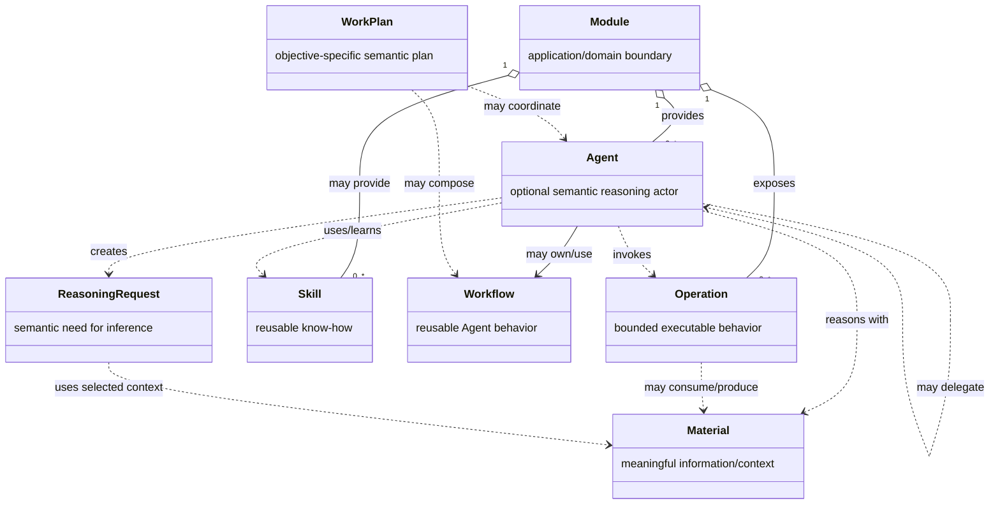
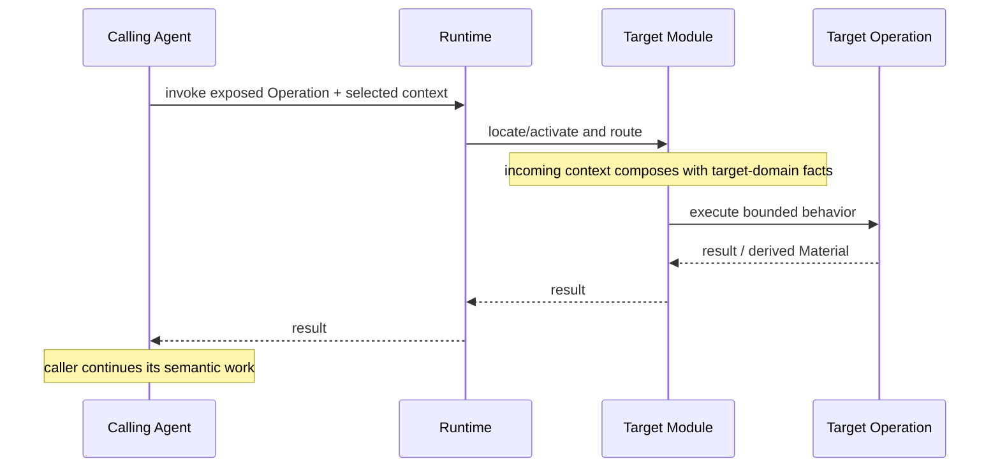
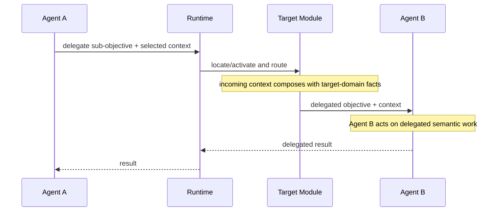
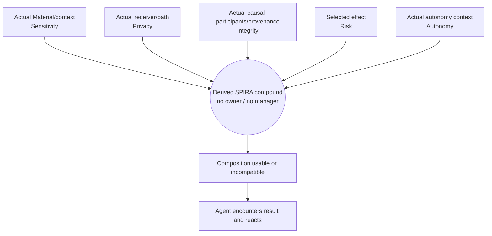
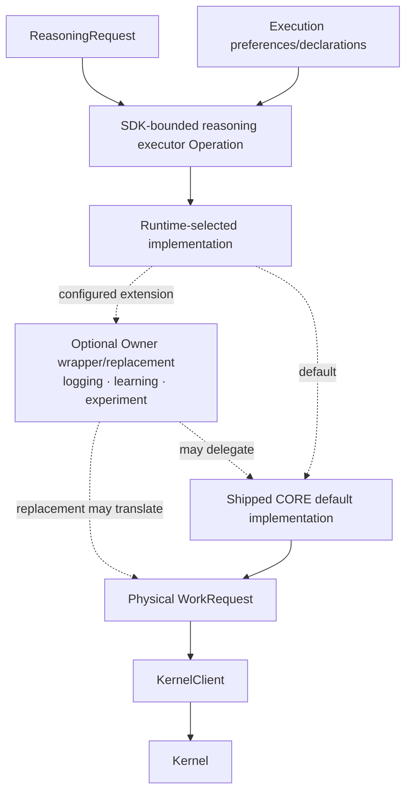
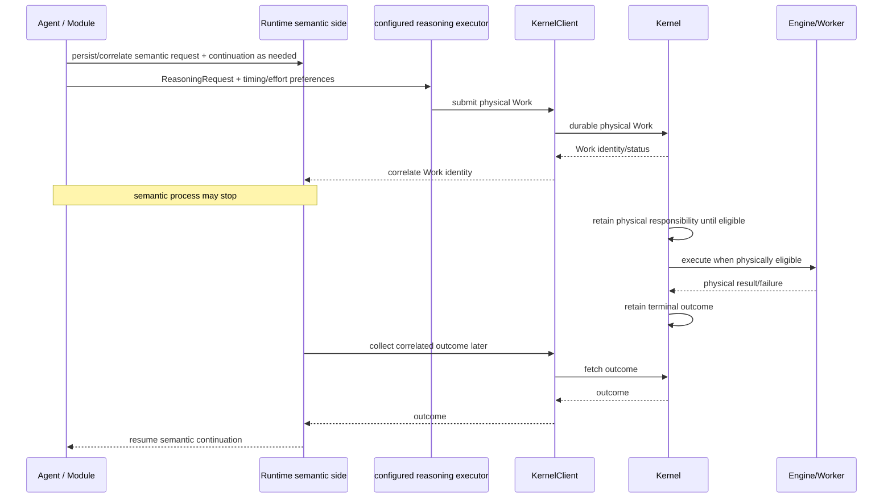
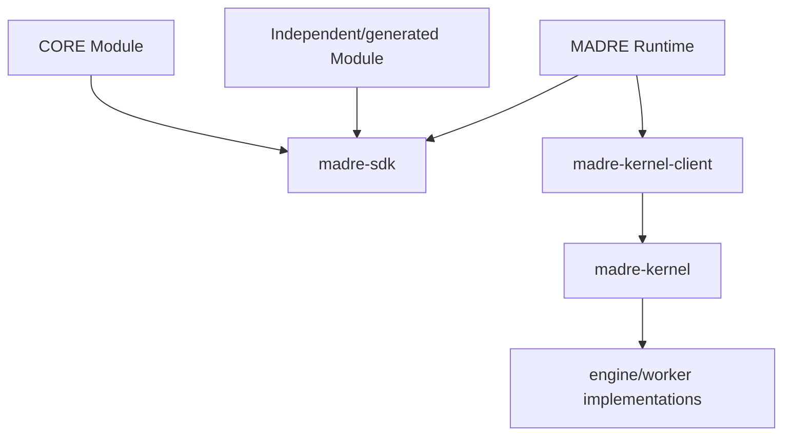

# MADRE — Mid-Level Architecture

This document translates the Product and Owner Intent Corpus into engineering boundaries.

It is intentionally **mid-level**: concrete enough to constrain implementation and explain the full system, but it does not invent private classes, protocols, persistence technology, package layouts or every Operation.

The architecture is organised around a simple rule:

> Assign ownership only where MADRE actually needs ownership. Preserve intrinsic composition as composition; do not create managers for relations.

## 1. System concerns

MADRE has three major engineering regions:


These are not three equivalent services.

- **Modules** contain application/domain meaning.
- **SDK** is the public construction surface shared by shipped, independent and generated software.
- **Runtime** is the installed semantic environment that coordinates Modules and shared reasoning execution.
- **Kernel client** is a small physical boundary artifact.
- **Kernel** knows only physical inference Work.
- **engines/workers** perform actual inference.

A Module may also use its own internal AI/inference system without using the shared Kernel. Kernel is not a universal interceptor.

## 2. Public SDK and Module boundary

A Module is an independently installable application/domain semantic boundary.



The diagram shows semantic relations, not a mandatory one-class-per-box Java design.

A Module may own internally:

- domain state and persistence;
- domain types;
- UI;
- integrations;
- internal intelligence;
- any implementation needed by its application.

Only the public semantic surface matters to MADRE composition.

A Module can be agentless, UI-less, very small, or a thin binding around existing software.

## 3. Operation invocation and Agent delegation are different

When Agent A invokes an Operation exposed by Module B, Agent A retains its semantic continuation. Module B does not need an Agent.



Explicit Agent delegation transfers a delegated semantic objective to another reasoning actor:



A WorkPlan may coordinate several Agents or Workflows. It is semantic planning, not Runtime scheduling and not Kernel Work.

## 4. SPIRA is intrinsic composition

SPIRA is not owned or managed by an Agent, Runtime service or central policy object.

Its dimensions live on the actual semantic facts where they mean something.

| Facet | Values 0 → 5 | Semantic carrier |
|---|---|---|
| Sensitivity | `SYSTEM_RESERVED`, `TRIVIAL`, `SHARED`, `PROFILING`, `SENSITIVE`, `SECRET` | actual Material/context |
| Privacy | `SYSTEM_RESERVED`, `PUBLIC`, `UNKNOWN`, `LOCAL`, `MODULE`, `ISOLATED` | actual receiver/exposure boundary |
| Integrity | `SYSTEM_RESERVED`, `NOT_DECLARED`, `DECLARED`, `TRUSTED`, `ACCEPTED`, `VALIDATED` | actual causal participants/provenance |
| Risk | `SYSTEM_RESERVED`, `READ`, `WRITE`, `DELETE`, `EXECUTE`, `POTENTIALLY_HARMFUL` | selected concrete effect |
| Autonomy | `SYSTEM_RESERVED`, `LIVE_INTERACTION`, `ASK_ALWAYS`, `ASK_ONCE`, `ACKNOWLEDGE`, `AUTONOMOUS` | actual autonomy context |

Integrity meanings:

- `NOT_DECLARED`: integrity cannot be traced or meaningfully claimed;
- `DECLARED`: comes from a manifested declaration that is not independently traceable;
- `TRUSTED`: trusted through established origin, common use or other evidence despite incomplete analysis;
- `ACCEPTED`: stronger assurance from effective boundaries, known origin, observable behaviour or direct Owner acceptance;
- `VALIDATED`: deterministically verifiable again when needed.

The compound arises because actual constituents compose:



Scope-local reductions are:

```text
S_scope = max(S_i)
P_path  = min(P_i)
I_scope = min(I_i)
```

The distinct compatibility relations are:

```text
DISCLOSURE:
max(S_disclosed) <= min(P_actual_path)

CONTROL:
D_C(e) = min(R(e), A(e))
D_C(e) <= min(I_controllers)

EFFECT EXECUTION:
R(e) <= min(I_executors)
```

Only actual constituents participate. Unused Operations, unrelated branches, hypothetical outputs and unrelated installed software do not contaminate the compound.

If the current composition is incompatible, the Agent does not rewrite the algebra. It reacts: choose another Operation/path, derive or minimise Material, ask the Owner, delegate, or stop that path. Different actual constituents produce a different composition.

A receiving Module can contribute additional domain knowledge and derive new Material or a new local sensitivity assessment. This does not create a global classifier.

## 5. Runtime responsibilities

Runtime is the installed semantic environment around Modules, SDK facilities and the Kernel boundary.

Its responsibilities are grouped by concern rather than represented as one central brain.

### Module environment

Runtime provides installation-wide mechanics for:

- Module installation/configuration;
- CORE role assignment;
- live discovery of exposed Module surfaces;
- activation/lifecycle;
- addressing;
- cross-Module Operation invocation;
- Agent delegation;
- Owner/runtime inspection and diagnostics.

Runtime routes semantic interactions without acquiring the Module's domain meaning.

### Shared reasoning execution

Runtime also provides installation-wide mechanics for:

- receiving semantic ReasoningRequests through the SDK;
- semantic request persistence/correlation needed for delayed reasoning;
- executing the configured semantic-to-physical translation Operation;
- correlating physical Kernel Work/results back to the semantic request;
- continuation/recovery support.

Runtime coordinates these responsibilities. Domain meaning remains with Modules/Agents.

## 6. ReasoningRequest → physical Work is a Module-owned special Operation

Agents create `ReasoningRequest` objects. They do **not** construct Kernel `WorkRequest` objects directly.

The public SDK defines a bounded function/Operation for the semantic-to-physical conversion:

```text
ReasoningRequest
+
execution preferences/declarations
        ↓
configured reasoning executor Operation
        ↓
physical WorkRequest / Kernel submission
```

The additional preference/declaration object is intentionally not frozen at this level. It expresses semantic caller preferences such as effort or timing without forcing Agent code to know Kernel mechanics.

This Operation is special only because basic MADRE functioning needs an implementation of it. It still follows MADRE modularity:

- Runtime executes it;
- its implementation belongs to a Module;
- the shipped default CORE Module provides the default implementation;
- Runtime keeps the installation-level selection of which implementation executes this required function;
- the Owner may replace, wrap or decorate that selection.



An Owner could, for example, place a logger/learning system in this flow and still delegate to the shipped default translator.

The seam is bounded: it does not own ReasoningRequest meaning, SPIRA or Kernel semantics.

## 7. Delayed Reasoning Effort

DRE spans semantic and physical persistence without collapsing them.



Semantic persistence may include the semantic request, relevant context, origin/correlation, continuation and interpretation state.

Kernel persistence contains only technical lifecycle: Work identity, technical requirements, eligibility/scheduling, engine attempts, resources, retry/cancel state and terminal physical result/failure.

Kernel correctness must not require the Module or Runtime process to remain alive while delayed physical Work exists.

## 8. Kernel boundary

The Kernel is a native physical inference control plane.

It owns:

- durable physical Work;
- technical inference requirements;
- eligibility and scheduling;
- engine inventory and factual engine descriptors;
- technical matching;
- scarce-resource admission/accounting;
- worker lifecycle/supervision;
- physical retry/cancellation;
- attempts and technical failures;
- terminal physical results.

It must not know or persist:

```text
Module
Agent
Operation semantics
Material
ReasoningRequest
SPIRA dimensions or explanations
CORE
Workflow / WorkPlan semantics
semantic continuation
semantic persistence
```

The Kernel may know physical facts such as engine location, model/provider identity, capabilities, resource requirements, health and loaded/warm state. The semantic side converts its meaning into technical requirements before Work crosses the boundary.

## 9. Kernel modularity without semantic leakage

MADRE's replaceability principle continues below the SDK boundary even though the Kernel does not depend on the SDK.

The Kernel should be solid by default but must not make its internal physical journey impossible to adapt. Physical concerns should have bounded enough implementation seams that the Owner can replace or interpose experiments without rewriting the complete subsystem.

Examples of legitimate physical experimentation include:

- a different engine-matching strategy;
- alternate resource-admission logic;
- extra physical observability;
- learning-assisted physical routing;
- an experiment that itself uses inference to improve routing.

An inference-assisted Kernel experiment is still Kernel implementation. It must reason only over physical facts and must not import Module, Agent, Material, SPIRA or other semantic MADRE concepts.

The design principle is:

> hard boundary between semantic and physical meaning; replaceable journeys inside each side.

This does not require a plugin framework or speculative extension API now. It requires avoiding architecture that makes replacement impossible without good reason.

## 10. CORE position

CORE is an ordinary Module assigned the CORE installation role.

The shipped default CORE may provide:

- ordinary Owner interaction;
- default/meta behaviour;
- default Agents;
- reusable general Operations/Skills;
- the shipped default implementation of Runtime-required Module-owned Operations such as the reasoning executor.

CORE is not Runtime, Kernel, owner of other Modules, or a special SPIRA authority.

Replacing the selected implementation of a required Runtime Operation is allowed because the implementation is Module-owned and Runtime selects it at installation level.

## 11. SDK as an automated construction target

The public SDK must be sufficient for independent and eventually AI-generated Modules.

```mermaid
sequenceDiagram
    participant O as Owner
    participant B as AI builder/service
    participant S as Public MADRE SDK
    participant T as Build/Test
    participant R as Runtime
    participant M as Installed Module

    O->>B: describe needed domain application/binding
    B->>S: use public contracts only
    B->>B: generate ordinary Module code
    B->>T: compile/test
    T-->>B: installable Module
    B->>R: install/configure
    R->>M: discover/activate when used
    Note over M: ordinary installed software; builder is not runtime mediation
```

A generated Module must not require hidden first-party hooks, Runtime internals or Kernel internals.

## 12. Logical dependency direction



Hard dependency rules:

```text
madre-kernel-client  -X-> madre-sdk
madre-kernel         -X-> madre-sdk
madre-kernel         -X-> MADRE Runtime
```

A Module may privately use external AI or other systems; that does not create a Kernel dependency.

## 13. Current implementation status

As of the integration of this architecture onto `main`:

### Implemented and CI-proven

Lane C provides:

- native C++ Kernel;
- durable physical Work;
- scheduling/recovery;
- worker lifecycle and resource accounting;
- local IPC;
- Java `madre-kernel-client` physical contract;
- native llama.cpp worker path;
- Linux and Windows validation/hardening.

The exact accepted Lane C head before this documentation integration was `fc7ce5c75bc84de5b277aaa91e796a97a54242fd`, with successful Lane C validation runs.

### Accepted architecture, not yet implemented in the active tree

The semantic SDK/Module layer and MADRE Runtime described above are the next missing large regions. Their absence must not be disguised by Kernel code or by resurrecting discarded historical implementations.

The active repository therefore represents the current MADRE direction honestly: **accepted whole-system semantics + implemented physical Kernel foundation + explicit semantic/runtime gaps**.

## 14. Engineering invariants

1. A Module owns its application/domain meaning; Runtime coordination does not absorb it.
2. Not every Module has an Agent.
3. Operation invocation does not imply Agent delegation.
4. SPIRA Compound is intrinsic to actual composition; no Agent manages it.
5. Only actual constituents participate in SPIRA scope.
6. Agents create semantic ReasoningRequests, not Kernel Work.
7. The ReasoningRequest→Work conversion is a bounded SDK Operation executed by Runtime and implemented by a selectable Module; shipped CORE provides the default.
8. Semantic continuation/persistence stays above Kernel.
9. Kernel owns physical Work and remains semantically blind.
10. Kernel internals remain replaceable/experimentable without importing semantic SDK concepts.
11. CORE is an ordinary Module with a role, not a privileged semantic subsystem.
12. Independent/generated Modules use the same public SDK as shipped software.
13. Modularity means small replaceable boundaries where a real responsibility exists—not a plugin framework for every possible future idea.