# MADRE — Mid-Level Architecture

This document translates the Product and Owner Intent Corpus into engineering boundaries.

It is intentionally **mid-level**: concrete enough to constrain implementation and explain the complete system, while avoiding speculative private classes, persistence technology, transport details or catalogues of every Operation.

Detailed SPIRA semantics are normative in `docs/architecture/security-algebra.md`.

The architecture follows two rules:

> Assign ownership only where MADRE actually needs ownership. Preserve intrinsic composition as composition rather than creating managers for relations.

> Keep public contracts explicit enough that an independent human or AI builder can implement a Module without private MADRE knowledge.

## 1. System concerns

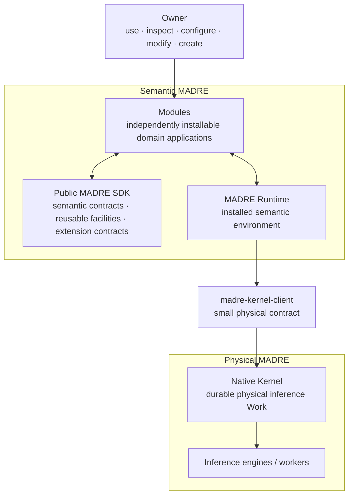

These are not equivalent services.

- **Modules** contain application/domain meaning.
- **SDK** is the public construction vocabulary shared by shipped, independent and generated software.
- **Runtime** is the installed semantic environment that composes Modules and shared MADRE facilities.
- **Kernel client** is a small physical boundary artifact.
- **Kernel** owns already-physical inference Work.
- **engines/workers** perform physical inference.

A Module may privately use another AI/inference environment without using the shared Kernel. Kernel is not a universal interceptor.

## 2. Module and SDK surface

A Module is an independently installable application/domain semantic boundary.

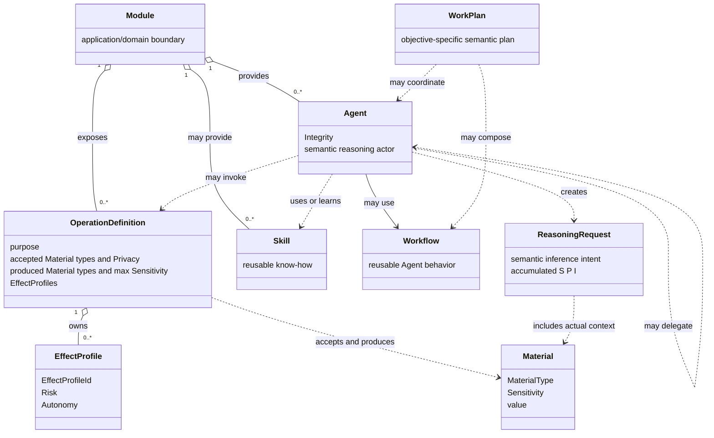

This is a semantic contract model, not a requirement for one Java class per box.

A Module may internally own domain state, persistence, UI, integrations, private agents or any other implementation its application needs. MADRE standardises only the public surfaces required for composition.

A Module may be agentless, UI-less, very small, or a thin binding around existing software.

## 3. Operation contract, EffectProfile and concrete call

SPIRA is operational because the relevant values are attached to the bounded contracts that actually own their meaning.

An Operation contract exposes:

```text
OperationDefinition
    identity / purpose
    acceptedMaterial[MaterialType] -> Privacy
    producedMaterial[MaterialType] -> maximum Sensitivity
    effectProfiles[EffectProfileId] -> EffectProfile
```

One consequential execution variant is:

```text
EffectProfile
    identity bound to its Operation
    Risk
    Autonomy
```

A concrete invocation is:

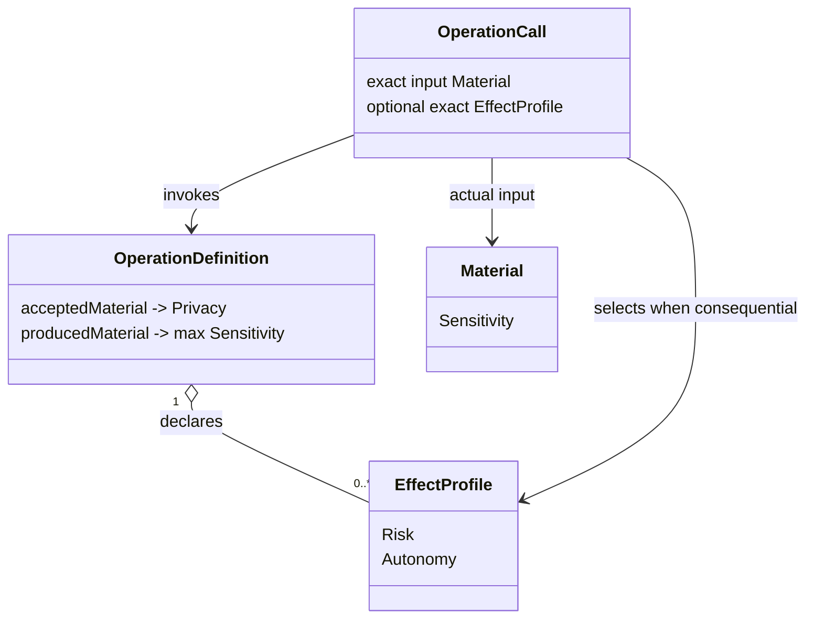

The call must use an accepted Material type. If the Operation declares consequential profiles, the call selects one exact profile belonging to that Operation. If the Operation is not consequential, it does not receive a dummy profile.

Output Material must be a declared produced type and must not exceed the maximum Sensitivity promised for that output type.

`OperationCall` binds the concrete facts. It is not itself a central authorization or policy evaluator.

## 4. SPIRA carriers and composition

The direct carriers are not interchangeable:

| Contract or actual fact | Value carried |
| --- | --- |
| concrete Material | Sensitivity |
| Operation accepted Material boundary | Privacy |
| Operation produced Material contract | maximum output Sensitivity |
| Agent | Integrity |
| other actual non-user causal participant | Integrity when it participates |
| actual effect realizer | Integrity when its fidelity matters |
| exact selected EffectProfile | Risk and Autonomy |

Same-dimension accumulation is:

```text
Sensitivity -> max
Privacy     -> min
Integrity   -> min
```

Risk and Autonomy stay paired on the exact selected EffectProfile; they are not general running aggregates.

The values are:

| Facet | 0 | 1 | 2 | 3 | 4 | 5 |
| --- | --- | --- | --- | --- | --- | --- |
| Sensitivity | SYSTEM_RESERVED | TRIVIAL | SHARED | PROFILING | SENSITIVE | SECRET |
| Privacy | SYSTEM_RESERVED | PUBLIC | UNKNOWN | LOCAL | MODULE | ISOLATED |
| Integrity | SYSTEM_RESERVED | NOT_DECLARED | DECLARED | TRUSTED | ACCEPTED | VALIDATED |
| Risk | SYSTEM_RESERVED | READ | WRITE | DELETE | EXECUTE | POTENTIALLY_HARMFUL |
| Autonomy | SYSTEM_RESERVED | LIVE_INTERACTION | ASK_ALWAYS | ASK_ONCE | ACKNOWLEDGE | AUTONOMOUS |

`SYSTEM_RESERVED` is not an ordinary authored value.

Integrity means increasing assurance, not privilege:

- `NOT_DECLARED`: cannot be traced or meaningfully claimed;
- `DECLARED`: manifested declaration without independent traceability;
- `TRUSTED`: established provenance/common use/other evidence despite incomplete analysis;
- `ACCEPTED`: stronger assurance from effective boundaries, known origin, observable behavior or direct Owner acceptance;
- `VALIDATED`: deterministically verifiable again when needed.

There is no Agent-owned `Compound` object. The compound is the algebraic structure inherent in the actual constituents of the current construction.

## 5. Information reach is a concrete boundary comparison

For Material actually entering one receiving path:

```text
S = max(Sensitivity of actual Material disclosed)
P = min(Privacy of actual receiving boundaries)

reachable iff S <= P
```

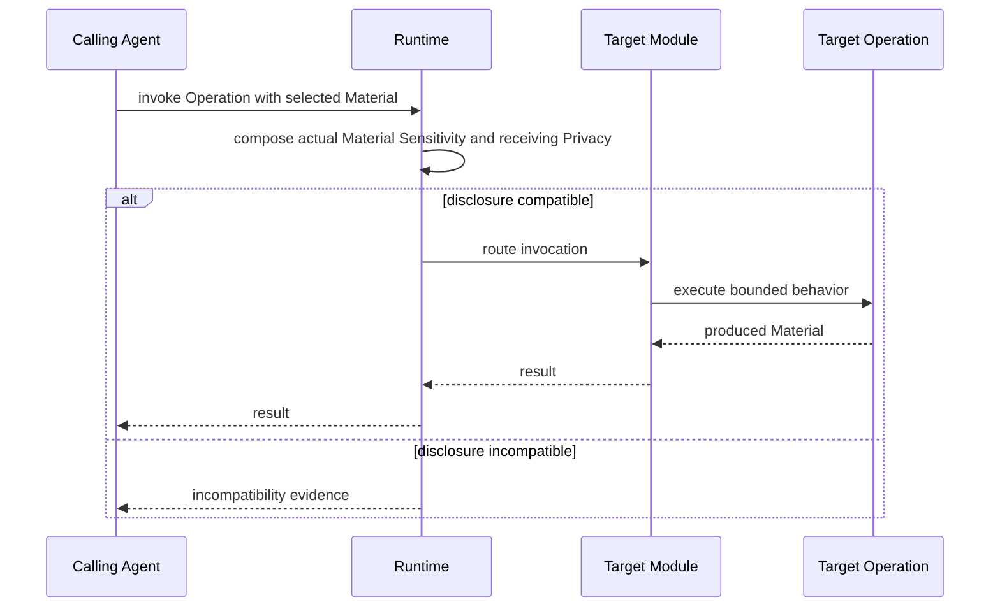

A high-Sensitivity Material not actually sent does not participate. A weak destination considered but rejected does not poison another route.

A Module may genuinely derive/minimise new Material with a different Sensitivity. That new representation is evaluated later; the source is not relabelled.

## 6. Consequential Operations have two distinct Integrity comparisons

For selected EffectProfile `e`:

```text
ControlDemand(e) = min(Risk(e), Autonomy(e))

ControlDemand(e)
    <= min(Integrity of actual non-user causal controllers)
```

When no non-user controller exists, rank 5 is the algebraic neutral element. It does not represent an imaginary controller.

The realization path is checked separately:

```text
Risk(e)
    <= min(Integrity of actual effect realizers)
```

This distinction matters. Direct Owner interaction can lower residual machine-control demand through the selected profile's Autonomy, but it cannot make an unreliable destructive/executable realization sound.

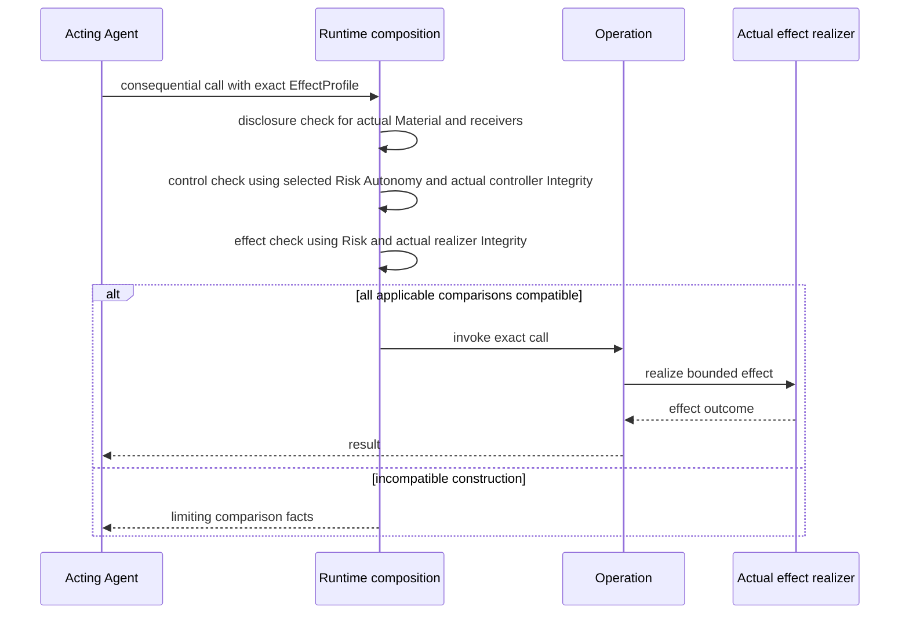

Runtime performs deterministic composition mechanics for Runtime-coordinated interactions; it does not become owner of those values. The participating contracts and actual causal topology supply them.

## 7. ReasoningRequest composes only its actual reasoning constituents

A ReasoningRequest is semantic inference intent. It is not the consequential parent Operation and it is not physical Work.

When reasoning is constructed from an Operation context, the request accumulates:

```text
ReasoningRequest.S
    = max(Sensitivity of actual reasoning Material)

ReasoningRequest.P
    = min(Privacy of actual reasoning receiving boundaries)

ReasoningRequest.I
    = min(Integrity of acting Agent and other actual reasoning causal participants)
```

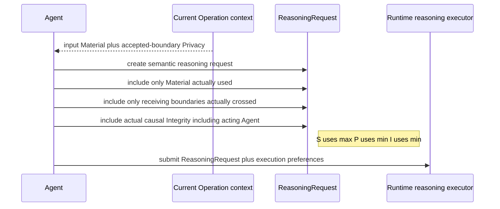

Risk and Autonomy from a surrounding Operation EffectProfile do **not** automatically become ReasoningRequest values. Ordinary inference does not itself realize the external effect.

If inference output later actually controls a consequential Operation, that later effect construction includes the relevant derived Material or causal participant plus the selected EffectProfile at that point.

This prevents both under-tracing and over-tainting.

## 8. Agent reaction is semantic behavior, not algebra management

An Agent encounters the compatible or incompatible structure produced by the actual construction. It may react by choosing another Operation or destination, deriving/minimizing Material, selecting another genuinely available EffectProfile, asking the Owner when that changes the actual interaction shape, delegating, or abandoning the route.

Changing the real constituents produces a different composition. The Agent does not mutate a security context until the same construction passes.

SPIRA itself never invokes a model. If classification or validation requires domain reasoning, a Module/Agent performs that work explicitly and produces the resulting semantic fact or new Material normally.

## 9. Cross-Module Operation invocation and Agent delegation are different

Operation invocation keeps the caller's semantic continuation:

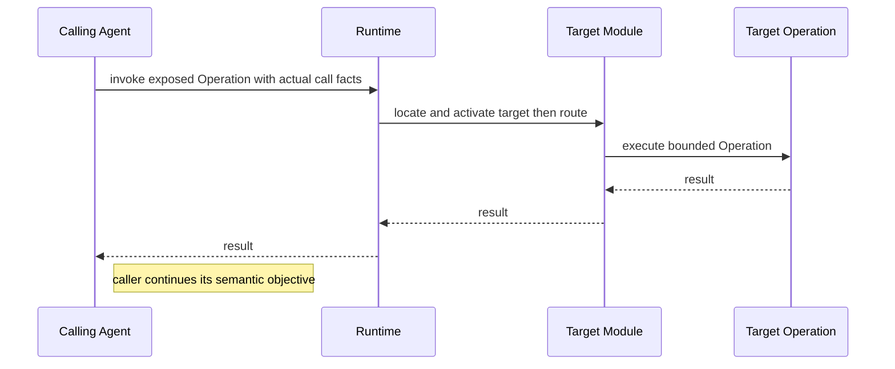

The target Module may have no Agent.

Explicit Agent delegation transfers a delegated semantic objective:

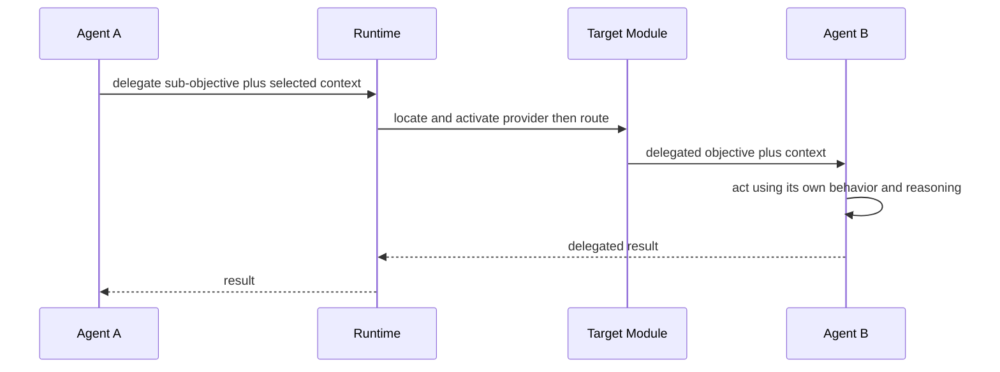

A WorkPlan may coordinate several Agents or Workflows. It is semantic planning, not Runtime scheduling and not Kernel Work.

## 10. Runtime responsibilities

Runtime is the installed semantic environment around Modules, public SDK facilities and the physical Kernel boundary.

Its responsibilities are grouped by concern rather than represented as one central brain.

### Module environment

- Module installation/configuration;
- CORE role assignment;
- live discovery of exposed Module surfaces;
- activation/lifecycle;
- addressing;
- cross-Module Operation invocation;
- Agent delegation;
- deterministic SPIRA composition at Runtime-coordinated boundaries;
- Owner/runtime inspection and diagnostics.

Runtime routes and composes semantic interactions without acquiring the Module's domain meaning.

### Shared reasoning execution

- receive semantic ReasoningRequests through the SDK;
- persist/correlate semantic delayed reasoning state where needed;
- execute the configured semantic-to-physical translation Operation;
- correlate physical Kernel Work/results back to semantic requests;
- continuation/recovery support.

## 11. ReasoningRequest to physical Work is a Module-owned special Operation

Agents create `ReasoningRequest`s. They do **not** construct Kernel `WorkRequest`s directly.

The SDK defines a bounded required function:

```text
ReasoningRequest
+
execution preferences/declarations
        ↓
configured reasoning executor Operation
        ↓
physical WorkRequest
```

The preference/declaration object is intentionally not frozen at this level. It lets semantic code express computation effort, timing and other Kernel-facing preferences without forcing Agents to understand physical scheduling mechanics.

This function follows the same MADRE modularity as other executable behavior:

- Runtime executes it;
- its implementation belongs to a Module;
- the shipped CORE Module provides the default implementation;
- Runtime stores the installation-level selection;
- the Owner may replace, wrap or decorate the implementation.


The selected implementation may use semantic SPIRA facts and factual physical engine descriptions to decide the acceptable physical candidate space. It then expresses that decision using physical Work constraints. SPIRA itself does not cross the Kernel boundary.

## 12. Delayed Reasoning Effort

DRE spans semantic and physical persistence without collapsing them.

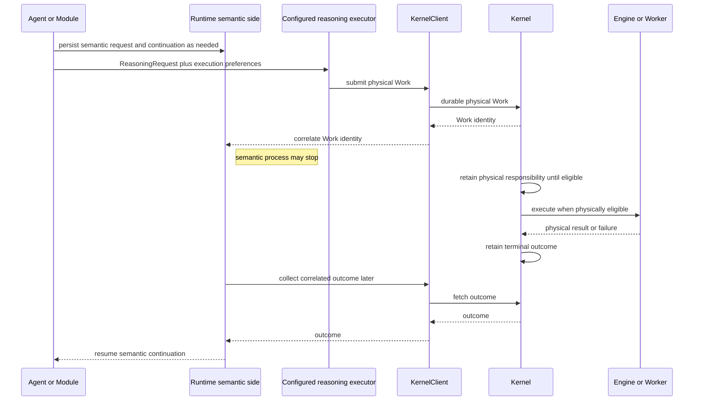

Semantic persistence may include the semantic request, relevant context, origin/correlation, continuation and interpretation state.

Kernel persistence contains only physical lifecycle: Work identity, technical requirements, eligibility/scheduling, attempts, resources, retry/cancel state and terminal result/failure.

Kernel correctness does not require Module or Runtime processes to remain alive while durable physical Work exists.

## 13. Kernel boundary

The Kernel is the native physical inference control plane.

It owns:

- durable physical Work;
- technical inference requirements;
- eligibility and scheduling;
- engine inventory and factual engine descriptors;
- technical matching;
- scarce-resource admission/accounting;
- worker lifecycle/supervision;
- physical retry/cancellation;
- attempts and technical failures;
- terminal physical results.

It must not know or persist:

```text
Module
Agent
Operation or EffectProfile semantics
Material
ReasoningRequest
Sensitivity Privacy Integrity Risk Autonomy
CORE
Skill Workflow WorkPlan semantics
semantic continuation
semantic persistence
```

The Kernel may know physical facts such as engine location, provider/model identity where applicable, capabilities, resources, health and warm/loaded state. Semantic software converts the meaning of those facts into technical constraints before physical Work crosses the boundary.

## 14. Kernel modularity without semantic leakage

MADRE's replaceability principle continues below the SDK boundary even though Kernel does not depend on the SDK.

Physical responsibilities should have bounded enough implementation seams that the Owner can replace or interpose experiments without rewriting the whole subsystem. Examples include another engine matcher, alternative resource admission, extra physical observability, or learning-assisted physical routing that itself uses inference.

Such an experiment remains physical Kernel behavior. It reasons over physical facts and does not import Modules, Agents, Material or SPIRA into Kernel.

This does not require a speculative generic plugin framework now. It requires avoiding unnecessary closed implementation journeys.

## 15. CORE position

CORE is an ordinary Module assigned the CORE installation role.

The shipped default CORE may provide ordinary Owner interaction, default/meta behavior, default Agents, reusable general Operations/Skills, and the shipped default implementation of Runtime-required Module-owned Operations such as the reasoning executor.

CORE is not Runtime, Kernel, owner of other Modules, or a special SPIRA authority.

## 16. SDK as automated construction target

The public SDK must be sufficient for independent and eventually AI-generated Modules.

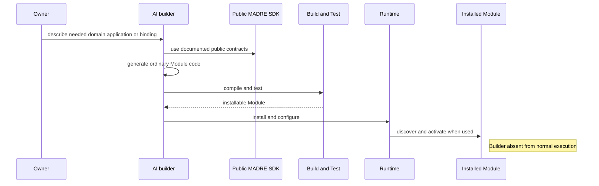

A generated Module must not require hidden first-party hooks, Runtime internals or Kernel internals. SPIRA is part of that public construction surface precisely so generated software can express bounded information/effect semantics explicitly rather than improvising security architecture.

## 17. Logical dependency direction

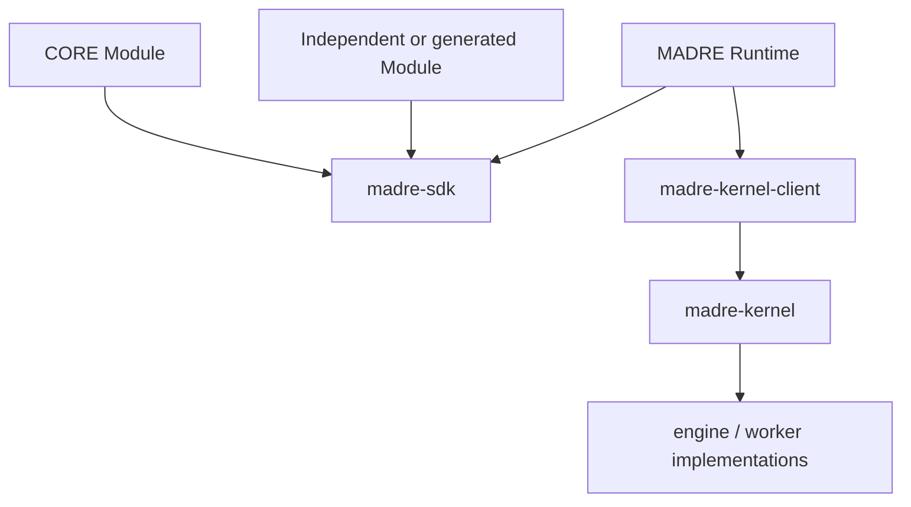

Hard dependency rules:

```text
madre-kernel-client  -X-> madre-sdk
madre-kernel         -X-> madre-sdk
madre-kernel         -X-> MADRE Runtime
```

A Module may privately use external AI or other systems without creating a Kernel dependency.

## 18. Current implementation status

### Implemented and CI-proven

Current `main` contains Lane C:

- native C++ Kernel;
- durable physical Work;
- scheduling/recovery;
- worker lifecycle and resource accounting;
- local IPC;
- Java `madre-kernel-client` physical contract;
- native llama.cpp worker path;
- Linux and Windows validation/hardening.

### Accepted architecture, not yet implemented in the active tree

The semantic SDK/Module layer and Runtime described in this document are accepted architecture but are not yet present in the active tree.

Historical semantic implementations are evidence for recovering already-settled contracts—such as `EffectProfile` and the operational SPIRA topology—but are not code to restore wholesale. New implementation must follow the current corpus and current architecture.

## 19. Engineering invariants

1. A Module owns its application/domain meaning; Runtime coordination does not absorb it.
2. Not every Module has an Agent.
3. Operation invocation does not imply Agent delegation.
4. SPIRA values live on the contracts/facts where they have established meaning; do not flatten them into one generic label.
5. Concrete Material carries Sensitivity; Operation input boundaries carry Privacy; Agents/actual causal participants contribute Integrity; exact EffectProfiles carry Risk and Autonomy.
6. An Operation owns its EffectProfiles; a consequential call selects one exact profile and a non-consequential call gets no dummy profile.
7. Information reach, causal control and effect realization are three different comparisons.
8. Only actual constituents participate; unrelated history or unused Operations do not contaminate the current construction.
9. No Agent owns or manages a SPIRA Compound; Agents react to intrinsic composition.
10. ReasoningRequest accumulates actual S/P/I reasoning constituents and does not automatically inherit parent EffectProfile Risk/Autonomy.
11. Agents create semantic ReasoningRequests, not Kernel Work.
12. ReasoningRequest-to-Work conversion is a bounded SDK Operation executed by Runtime and implemented by a selectable Module; shipped CORE provides the default.
13. Semantic continuation/persistence remains above Kernel.
14. Kernel owns physical Work and remains semantically blind.
15. Kernel internals remain replaceable/experimentable without importing semantic SDK concepts.
16. CORE is an ordinary Module with a role, not a privileged semantic subsystem.
17. Independent/generated Modules use the same public SDK as shipped software.
18. Modularity means small replaceable boundaries where a real responsibility exists, not a plugin framework for every possible future idea.