# MADRE — Mid-Level Architecture

This document translates the Product and Owner Intent Corpus plus the accepted Lane C Owner decision into engineering boundaries.

It is intentionally **mid-level**: concrete enough to constrain implementation and explain the complete system, while avoiding speculative private classes, persistence technology beyond currently accepted choices, transport details or exhaustive Operation/capability catalogues.

Normative SPIRA semantics are in `docs/architecture/security-algebra.md`. The causal rationale for the current DRE/physical-inference correction is preserved in `docs/product/lane-c-owner-decision.md`.

Two rules govern this architecture:

> Assign ownership only where MADRE actually needs ownership. Preserve intrinsic composition as composition rather than creating managers for relations.

> Keep public contracts explicit enough that an independent human or AI builder can implement a Module—and an advanced Owner can extend physical inference—without hidden first-party knowledge.

## 1. System concerns

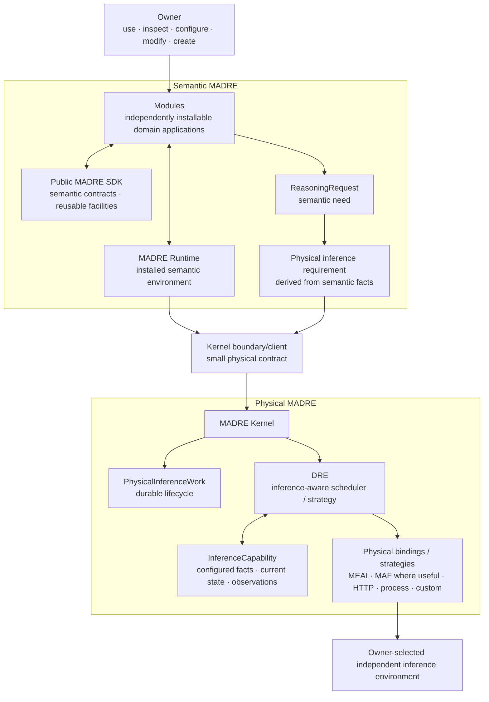
```mermaid
flowchart TB
    O["Owner<br/>use · inspect · configure · modify · create"]

    subgraph S["Semantic MADRE"]
      M["Modules<br/>independently installable domain applications"]
      SDK["Public MADRE SDK<br/>semantic contracts · reusable facilities"]
      RT["MADRE Runtime<br/>installed semantic environment"]
      RR["ReasoningRequest<br/>semantic need"]
      PR["Physical inference requirement<br/>derived from semantic facts"]
    end

    KC["Kernel boundary/client<br/>small physical contract"]

    subgraph P["Physical MADRE"]
      W["PhysicalInferenceWork<br/>durable lifecycle"]
      DRE["DRE<br/>inference-aware scheduler / strategy"]
      CAP["InferenceCapability<br/>configured facts · current state · observations"]
      B["Physical bindings / strategies<br/>MEAI · MAF where useful · HTTP · process · custom"]
      K["MADRE Kernel"]
    end

    E["Owner-selected independent inference environment"]

    O --> M
    M <--> SDK
    M <--> RT
    M --> RR
    RR --> PR
    RT --> KC
    PR --> KC
    KC --> K
    K --> W
    K --> DRE
    DRE <--> CAP
    DRE --> B
    B --> E
```

These are not equivalent services.

- **Modules** contain application/domain meaning.
- **SDK** is the public construction vocabulary shared by shipped, independent and generated software.
- **Runtime** supplies the installed semantic environment: Module lifecycle/discovery/routing plus shared semantic execution mechanics and correlation with physical inference Work.
- **ReasoningRequest** is semantic.
- **physical inference requirement** contains only the physical consequences semantic MADRE can derive for Kernel.
- **Kernel** owns durable physical inference Work, configured capability knowledge/observations, DRE scheduling/strategy and physical execution.
- **InferenceCapability** describes an available physical intelligence path as experienced by MADRE; it is not a provider/model/worker ontology.
- **physical bindings/strategies** are replaceable implementation mechanisms beneath MADRE's physical concepts.

A Module may privately use another AI/inference environment without using the shared Kernel. Kernel is not a universal interceptor.

## 2. Module boundary

A Module is an independently installable application/domain semantic boundary.

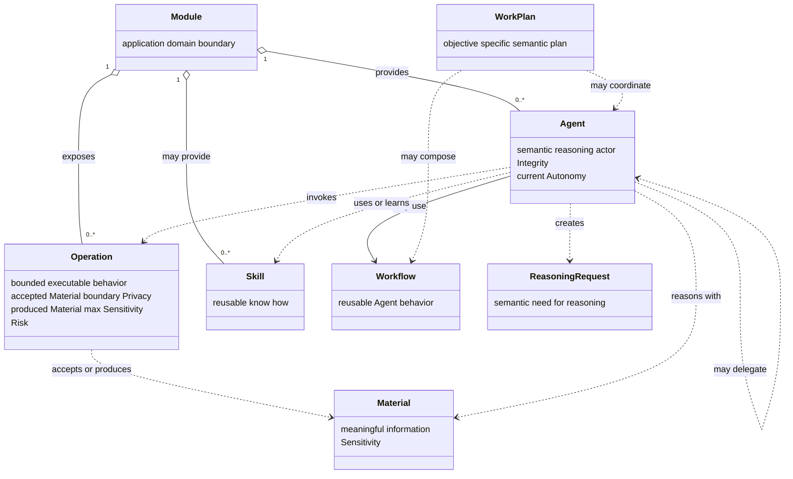
```mermaid
classDiagram
    class Module {
      application domain boundary
    }
    class Agent {
      semantic reasoning actor
      Integrity
      current Autonomy
    }
    class Operation {
      bounded executable behavior
      accepted Material boundary Privacy
      produced Material max Sensitivity
      Risk
    }
    class Skill {
      reusable know how
    }
    class Workflow {
      reusable Agent behavior
    }
    class WorkPlan {
      objective specific semantic plan
    }
    class Material {
      meaningful information
      Sensitivity
    }
    class ReasoningRequest {
      semantic need for reasoning
    }

    Module "1" o-- "0..*" Agent : provides
    Module "1" o-- "0..*" Operation : exposes
    Module "1" o-- "0..*" Skill : may provide
    Agent --> Workflow : may use
    Agent ..> Operation : invokes
    Agent ..> Skill : uses or learns
    Agent ..> ReasoningRequest : creates
    Agent ..> Agent : may delegate
    WorkPlan ..> Agent : may coordinate
    WorkPlan ..> Workflow : may compose
    Operation ..> Material : accepts or produces
    Agent ..> Material : reasons with
```

This is a semantic contract model, not a requirement for one Java class per box.

A Module may internally own domain state, persistence, UI, integrations, private intelligence and any implementation its application needs. Only the public semantic surface matters to MADRE composition.

A Module may be agentless, UI-less, very small, or a thin binding around existing software.

## 3. Agent and Operation are actor and action

An Agent is the semantic actor. An Operation is one bounded action the actor can perform.

A Module can expose Operations without providing an Agent. Another Agent can invoke them.

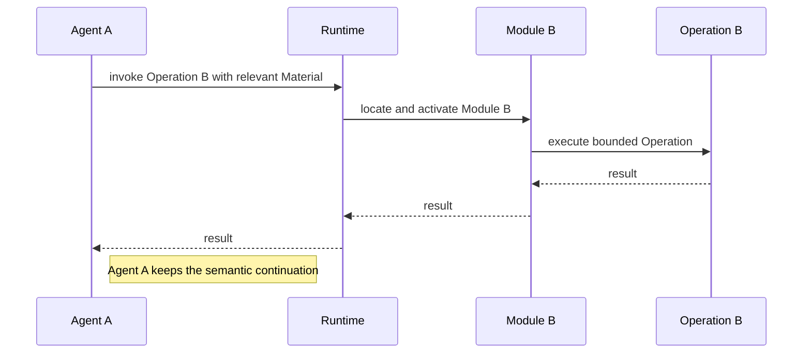
```mermaid
sequenceDiagram
    participant A as Agent A
    participant R as Runtime
    participant B as Module B
    participant O as Operation B

    A->>R: invoke Operation B with relevant Material
    R->>B: locate and activate Module B
    B->>O: execute bounded Operation
    O-->>B: result
    B-->>R: result
    R-->>A: result
    Note right of A: Agent A keeps the semantic continuation
```

Runtime transports and activates. It does not become the actor merely because it routes the call.

An explicit Agent delegation is different:

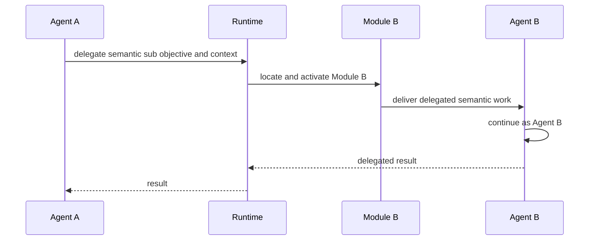
```mermaid
sequenceDiagram
    participant A as Agent A
    participant R as Runtime
    participant B as Module B
    participant C as Agent B

    A->>R: delegate semantic sub objective and context
    R->>B: locate and activate Module B
    B->>C: deliver delegated semantic work
    C->>C: continue as Agent B
    C-->>R: delegated result
    R-->>A: result
```

The distinction is fundamental:

```text
Operation invocation -> another bounded action is used; initiating Agent keeps the continuation
Agent delegation     -> another Agent receives delegated semantic continuation
```

A WorkPlan may coordinate multiple Agents and Workflows, but it is semantic planning rather than Runtime scheduling or Kernel Work.

## 4. SPIRA direct carriers

SPIRA is not one universal security context. Each facet comes from the semantic fact where it actually has meaning.

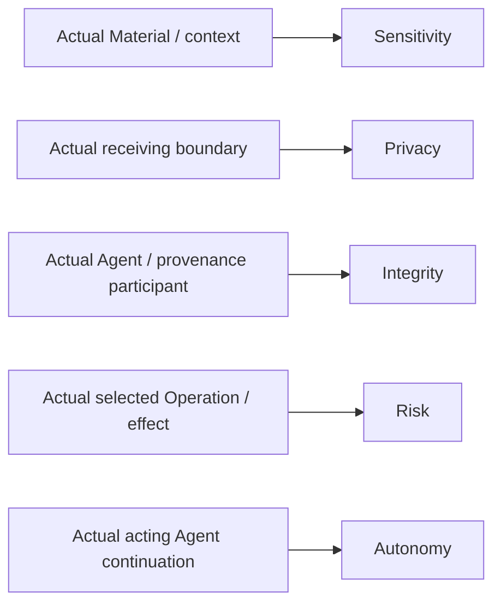
```mermaid
flowchart LR
    M["Actual Material / context"] --> S["Sensitivity"]
    D["Actual receiving boundary"] --> P["Privacy"]
    C["Actual Agent / provenance participant"] --> I["Integrity"]
    O["Actual selected Operation / effect"] --> R["Risk"]
    A["Actual acting Agent continuation"] --> U["Autonomy"]
```

Current values are:

| Facet | 0 | 1 | 2 | 3 | 4 | 5 |
| --- | --- | --- | --- | --- | --- | --- |
| Sensitivity | SYSTEM_RESERVED | TRIVIAL | SHARED | PROFILING | SENSITIVE | SECRET |
| Privacy | SYSTEM_RESERVED | PUBLIC | UNKNOWN | LOCAL | MODULE | ISOLATED |
| Integrity | SYSTEM_RESERVED | NOT_DECLARED | DECLARED | TRUSTED | ACCEPTED | VALIDATED |
| Risk | SYSTEM_RESERVED | READ | WRITE | DELETE | EXECUTE | POTENTIALLY_HARMFUL |
| Autonomy | SYSTEM_RESERVED | LIVE_INTERACTION | ASK_ALWAYS | ASK_ONCE | ACKNOWLEDGE | AUTONOMOUS |

Integrity means increasing assurance:

- `NOT_DECLARED`: cannot be traced or meaningfully claimed;
- `DECLARED`: manifested declaration without independent traceability;
- `TRUSTED`: established provenance, common use or other evidence despite incomplete analysis;
- `ACCEPTED`: stronger assurance from effective boundaries, known origin, observable behavior or direct Owner acceptance;
- `VALIDATED`: deterministically verifiable again when needed.

Same-facet reductions are:

```text
Sensitivity = max(actual participating Sensitivities)
Privacy     = min(actual participating Privacies)
Integrity   = min(actual participating Integrities)
```

Risk is the Risk of the actual selected Operation/effect. Autonomy is the Autonomy of the actual acting Agent continuation. They are not generic running aggregates.

There is no mandatory `EffectProfile` in the current architecture. Earlier implementation experiments paired Risk and Autonomy, but the settled model keeps them separate because they belong to different actual constituents.

## 5. Operation semantic surface

An Operation can expose the semantic facts necessary to compose with it before executing arbitrary implementation code.

Conceptually:

```text
Operation
    accepted Material type -> receiving Privacy
    produced Material type -> maximum promised Sensitivity
    concrete behavior/effect -> Risk
```

The exact Java representation is not fixed at this level.

Produced Material that promises a bounded maximum Sensitivity must honor that semantic contract. A Module can deliberately produce a new minimized/anonymized representation with lower Sensitivity, but that new representation is distinct from its source.

Derived summaries may be useful for discovery. These are views derived from the real constituents, not additional owners of a facet.

## 6. Intrinsic SPIRA compound

No Agent or Runtime component owns a mutable Compound object.

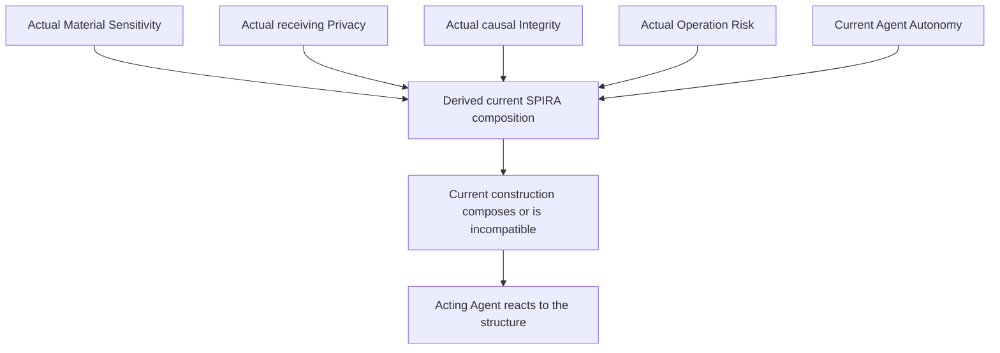
```mermaid
flowchart TB
    S["Actual Material Sensitivity"] --> C["Derived current SPIRA composition"]
    P["Actual receiving Privacy"] --> C
    I["Actual causal Integrity"] --> C
    R["Actual Operation Risk"] --> C
    A["Current Agent Autonomy"] --> C
    C --> X["Current construction composes or is incompatible"]
    X --> G["Acting Agent reacts to the structure"]
```

Only actual constituents contribute. Unused Operations, possible future results, installed capabilities and unrelated branches do not contaminate the current construction.

The Agent does not decide what the algebra should say. The Agent decides what to try. The SPIRA structure follows from the real semantic pieces of that attempt.

## 7. Where SPIRA facets meet

There is no global SPIRA score and no central evaluator object. Facets meet where a concrete semantic construction makes their relation relevant.

### Actual information entering an actual receiver

```text
max(S_actual_information) <= min(P_actual_receiving_boundaries)
```

A Material that is not sent does not participate. A destination considered but rejected does not contaminate another path.

### Actual Operation under the current Agent continuation

```text
min(R_actual_operation, A_current_agent_continuation)
    <= min(I_actual_non_user_causal_participants)
```

Owner interaction can alter the real Agent continuation and therefore Autonomy. It does not lower the Operation's Risk.

### Actual effect realization

Where effect realizers carry semantically relevant Integrity:

```text
R_actual_operation
    <= min(I_actual_effect_realizers)
```

A lower-Autonomy continuation does not make an unreliable high-consequence realization reliable.

These are intrinsic composition relations, not authorization or permission checks. A compatible current construction can continue; an incompatible exact construction cannot continue unchanged.

The Agent can change reality and derive again: choose another Operation/path, derive new Material, change continuation through Owner interaction, delegate, use another real participant, or stop.

## 8. Module-local semantic re-evaluation

Module boundaries are meaningful because Modules know their domains.

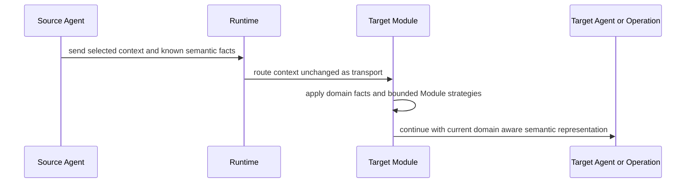
```mermaid
sequenceDiagram
    participant A as Source Agent
    participant R as Runtime
    participant M as Target Module
    participant B as Target Agent or Operation

    A->>R: send selected context and known semantic facts
    R->>M: route context unchanged as transport
    M->>M: apply domain facts and bounded Module strategies
    M->>B: continue with current domain aware semantic representation
```

The target does not blindly inherit one eternally global sensitivity label, and it does not discard source knowledge. It can derive a different current representation or sensitivity where its domain knowledge justifies it.

If a domain strategy genuinely needs reasoning, an Agent creates a ReasoningRequest. SPIRA itself does not secretly call a model.

## 9. ReasoningRequest remains semantic

A ReasoningRequest is created by an Agent when reasoning is actually needed.

It may involve context, Material, provenance, Owner instruction, relevant SPIRA facts and the reasoning objective.

The architecture deliberately does **not** define a mandatory `ReasoningRequest.S/P/I/R/A` tuple.

Risk remains with an actual Operation/effect. Autonomy remains with the current Agent continuation. Other facets remain with the actual objects/boundaries/provenance that contribute them.

The ReasoningRequest does not cross into Kernel as a semantic object.

Semantic MADRE instead derives the physical inference facts Kernel actually needs.

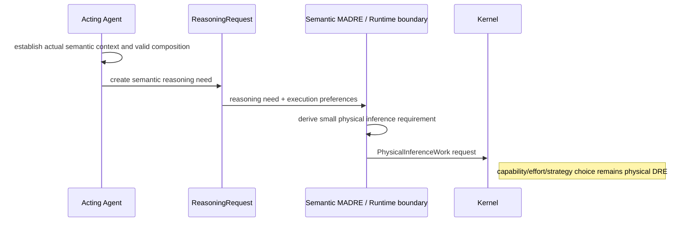
```mermaid
sequenceDiagram
    participant A as Acting Agent
    participant Q as ReasoningRequest
    participant S as Semantic MADRE / Runtime boundary
    participant K as Kernel

    A->>A: establish actual semantic context and valid composition
    A->>Q: create semantic reasoning need
    Q->>S: reasoning need + execution preferences
    S->>S: derive small physical inference requirement
    S->>K: PhysicalInferenceWork request
    Note right of K: capability/effort/strategy choice remains physical DRE
```

The exact public request type is design work. It must not become a second semantic ontology inside Kernel.

## 10. Runtime responsibilities

Runtime is the installed semantic environment around Modules, SDK facilities and the physical Kernel boundary.

### Module environment

Runtime provides installation mechanics for:

- Module installation/configuration;
- CORE role assignment;
- live discovery of exposed Module surfaces;
- activation/lifecycle;
- addressing;
- routing cross-Module Operation calls;
- routing Agent delegation;
- Owner/runtime inspection and diagnostics.

Runtime provides the mechanics. It does not acquire the Module's domain meaning and does not become the evaluator of SPIRA.

### Shared reasoning execution

Runtime also provides installation mechanics for:

- persistence/correlation needed for delayed semantic reasoning;
- correlation between semantic requests and physical Kernel Work/results;
- semantic continuation/recovery support;
- transporting the physical inference requirement derived from semantic facts;
- Owner-facing inference configuration/inspection where appropriate.

The meaning of the reasoning remains in the responsible Agent/Module semantic process.

There is no Runtime-owned global semantic scheduler merely because Kernel physical inference can remain outstanding for a long time.

## 11. Semantic-to-physical inference contract

Agents create `ReasoningRequest`s. They do **not** construct Kernel `PhysicalInferenceWork` directly.

Conceptually:

```text
ReasoningRequest
+
actual semantic context/preferences
        ↓
semantic derivation
        ↓
prepared input
requested result characteristics
reasoning effort/depth indication
context/modality characteristics
urgency
acceptable delay / deadline
hard physical restrictions
Owner execution preferences where relevant
        ↓
PhysicalInferenceWork request
```

Only physical consequences cross the boundary. The request must not contain Module/Agent/MADRE Workflow/WorkPlan semantics, Operation meaning, raw SPIRA as a Kernel policy object or semantic continuation.

The first version must remain small. A field is justified by an implemented DRE consumer, not by hypothetical platform flexibility.

The previous LCR1–LCR3 boundary that supplied an exact `ConcretePhysicalInvocation` candidate set before Kernel is retained only as implementation evidence. It is not the target contract because it removes meaningful capability/effort selection from Kernel DRE.

## 12. Delayed Reasoning Effort

DRE is the physical inference scheduling problem after semantic MADRE has derived the requirements it can know from application meaning.

There is no separate generic scheduler with all meaningful policy elsewhere. Questions such as these are themselves DRE:

```text
run now or later?
which admissible capability is currently appropriate?
should current availability/observations justify waiting?
how much physical reasoning effort?
one inference or a richer physical strategy?
retry/escalate after which physical outcome?
resume a checkpointed physical strategy now?
```

Durable eligibility, deadlines, leases, transactions and restart recovery are persistence mechanics underneath those decisions.

Semantic continuation remains with the Agent/Module while physical inference is outstanding.

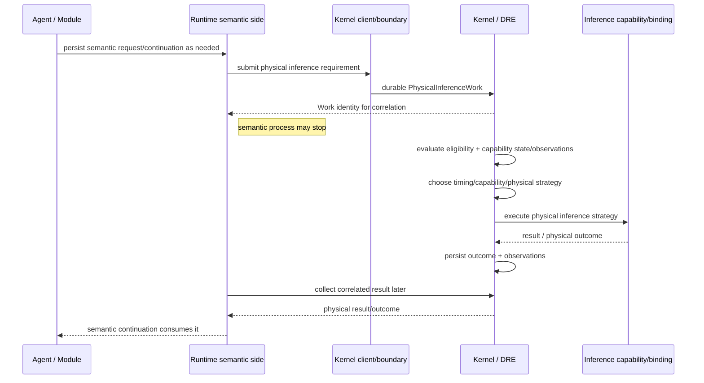
```mermaid
sequenceDiagram
    participant A as Agent / Module
    participant R as Runtime semantic side
    participant C as Kernel client/boundary
    participant K as Kernel / DRE
    participant I as Inference capability/binding

    A->>R: persist semantic request/continuation as needed
    R->>C: submit physical inference requirement
    C->>K: durable PhysicalInferenceWork
    K-->>R: Work identity for correlation
    Note right of R: semantic process may stop
    K->>K: evaluate eligibility + capability state/observations
    K->>K: choose timing/capability/physical strategy
    K->>I: execute physical inference strategy
    I-->>K: result / physical outcome
    K->>K: persist outcome + observations
    R->>K: collect correlated result later
    K-->>R: physical result/outcome
    R-->>A: semantic continuation consumes it
```

## 13. Kernel physical model

Kernel owns shared physical inference concepts rather than external inference engines.

### PhysicalInferenceWork

One authoritative durable Work lifecycle holds the physical request and execution state needed for DRE/recovery.

Conceptually:

```text
PhysicalInferenceWork
    id / state
    physical requirement / hard constraints
    urgency / eligibleAt / deadline
    strategy identity + version/state
    attempts / selected capabilities
    checkpoint reference where applicable
    lease/recovery state
    result state
```

SQLite is the leading local persistence choice for the first implementation unless a concrete need demonstrates otherwise.

### InferenceCapability

An `InferenceCapability` is a physical path through which MADRE can obtain intelligence.

It separates:

```text
identity + execution binding

CONFIGURED / DECLARED
    locality/external boundary
    modalities
    context characteristics
    declared inference/reasoning features
    cost characteristics where meaningful
    Owner configuration/preferences

CURRENT
    reachability/availability
    transient degradation/limits
    observable pressure where meaningful

HISTORICAL / OBSERVED
    latency
    throughput
    failures/error rates
    availability history
    malformed/incomplete-result rates
    observed cost
    benchmark/evaluation evidence with provenance where supplied
```

Provider claims, Owner declarations and MADRE observations remain distinguishable evidence.

Only properties with real DRE consumers belong in the initial typed core.

### Physical observations versus semantic judgment

Kernel may learn physical facts from actual use and feed them into future DRE decisions.

Kernel does not decide that a physically valid result is semantically poor. Application-level dissatisfaction belongs to the Agent/Module.

```text
executor retry
    transient physical/executor failure

DRE retry / escalation
    unusable/incomplete physical result
    or explicit physical strategy condition

semantic retry
    valid result does not satisfy application reasoning need
    -> Agent/Module
```

### Physical multi-stage strategy

DRE may choose multiple inference calls, structural/physical validation, fan-out/fan-in, comparison or synthesis.

Such a strategy is not a MADRE semantic Workflow. Physical workflow machinery must not silently acquire application effects such as modifying Module state, sending application email, committing project/domain state or invoking another Module's semantic Operation.

Opaque inference systems are valid. Kernel models only what can honestly be known at their boundary.

## 14. Physical construction surface and framework containment

The leading target implementation is a cross-platform .NET Kernel because the relevant workload is now asynchronous integration, structured configuration, capability knowledge/observations, durable Work, inference-aware scheduling and optional physical workflow execution rather than native model lifecycle.

### Microsoft.Extensions.AI

MEAI may provide generic model/inference interoperability behind capability bindings.

`InferenceCapability` is not `IChatClient`.

### Microsoft Agent Framework

MAF may provide physical workflow graphs, provider/runtime integrations, fan-out/fan-in, executor sequencing, checkpoint/resume and custom physical implementations where useful.

It does not define MADRE ontology:

```text
MADRE Agent         != MAF AIAgent
MADRE Workflow      != MAF Workflow
InferenceCapability != IChatClient
InferenceCapability != MAF AIAgent
InferenceCapability != MAF Workflow
DRE                  != MAF
```

A MAF Workflow may execute a physical graph selected by DRE. Simple inference is not required to use a workflow.

Framework checkpoint state is subordinate to MADRE `PhysicalInferenceWork`. It cannot independently decide whether Work exists, is cancelled, terminal or resumable.

### Open physical binding seam

Useful physical bindings may include:

```text
MEAI/provider integration
OpenAI-compatible endpoint
generic HTTP/protocol
process/script wrapper
A2A/remote intelligence
Owner-provided .NET/service/executable binding
future mechanism
```

The first version does not require a connector marketplace, dynamic NuGet ecosystem or hot-loading architecture.

The practical requirement is that unusual Owner-controlled inference normally be integrable by configuration or a binding rather than by provider-specific changes to Kernel architecture.

MADRE-provided adapters use the same class of physical construction surface available to advanced Owners. A provider/runtime never receives a privileged Kernel ontology merely because MADRE ships a convenience adapter for it.

Generic scheduler/workflow platforms such as Quartz, Wolverine, Elsa or Temporal are not currently part of the target. They may be reconsidered if concrete requirements make them simpler than the small MADRE-owned durable substrate.

## 15. CORE position

CORE is an ordinary Module assigned the CORE installation role.

The shipped default CORE may provide ordinary Owner interaction, default/meta behavior, default Agents and reusable general Operations/Skills.

CORE is not Runtime, Kernel, owner of other Modules, or a special SPIRA authority.

Physical inference capability knowledge and DRE scheduling are Kernel responsibilities, not hidden CORE semantics.

## 16. SDK as automated construction target

The public SDK must be sufficient for independent and eventually AI-generated Modules.

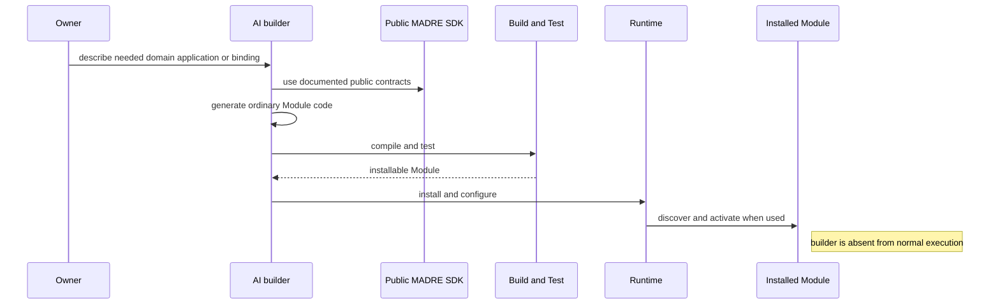
```mermaid
sequenceDiagram
    participant O as Owner
    participant B as AI builder
    participant S as Public MADRE SDK
    participant T as Build and Test
    participant R as Runtime
    participant M as Installed Module

    O->>B: describe needed domain application or binding
    B->>S: use documented public contracts
    B->>B: generate ordinary Module code
    B->>T: compile and test
    T-->>B: installable Module
    B->>R: install and configure
    R->>M: discover and activate when used
    Note right of M: builder is absent from normal execution
```

A generated Module must not require hidden first-party hooks, Runtime internals or Kernel internals. SPIRA is part of the public construction vocabulary so generated software can express its actual information, receiving-boundary, provenance, consequence and autonomy semantics without inventing another security architecture.

At the physical layer, an advanced Owner should likewise be able to create an unusual inference binding through the same class of construction surface used by provided adapters, without privileged first-party Kernel APIs.

## 17. Logical dependency direction

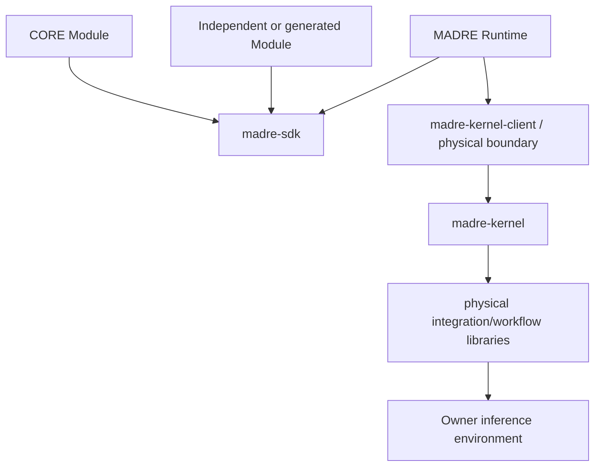
```mermaid
flowchart TB
    SDK["madre-sdk"]
    CORE["CORE Module"]
    MOD["Independent or generated Module"]
    RT["MADRE Runtime"]
    KC["madre-kernel-client / physical boundary"]
    K["madre-kernel"]
    P["physical integration/workflow libraries"]
    E["Owner inference environment"]

    CORE --> SDK
    MOD --> SDK
    RT --> SDK
    RT --> KC
    KC --> K
    K --> P
    P --> E
```

Hard dependency rules:

```text
madre-kernel-client  -X-> madre-sdk
madre-kernel         -X-> madre-sdk
madre-kernel         -X-> MADRE Runtime
```

Kernel may use physical implementation libraries internally. Those libraries do not leak into the public semantic SDK.

A Module may privately use external AI or other systems without creating a Kernel dependency.

## 18. Current implementation status

### Implemented and CI-proven reference behavior

The active Lane C/LCR1–LCR3 branch contains:

- native C++ Kernel;
- SQLite durable physical Work;
- eligibility/scheduling and restart recovery;
- candidate-specific one-shot `ProcessInvocation` and generic `HttpInvocation` execution;
- bounded retry/cancellation and conservative `UNKNOWN_COMPLETION` for interrupted attempts;
- result/payload release lifecycle;
- isolated local Unix-domain socket / Windows named-pipe IPC;
- Java physical client at protocol v4;
- Linux and Windows behavioral CI evidence.

The active Kernel does not include a model/provider inventory, warm worker/model lifecycle, llama.cpp integration or model downloads.

These behaviors are evidence/test requirements for replacement where still relevant.

### Accepted target architecture, not yet implemented

The current C++ concrete-invocation Kernel is no longer the target Lane C architecture because its boundary completes provider/model/invocation selection before Kernel DRE can make capability-aware physical decisions.

The target Kernel is capability-aware and receives a small physical inference requirement rather than a fully preselected concrete invocation set.

The leading implementation candidature is .NET + SQLite + MEAI where useful + selective MAF physical workflow/checkpoint infrastructure + generic/custom physical binding seams.

The semantic SDK/Module layer and Runtime described in this document are also accepted architecture but are not yet present in the active tree.

Historical implementations remain evidence. They do not outrank later Owner corrections.

## 19. Engineering invariants

1. A Module owns its application/domain meaning; Runtime coordination does not absorb it.
2. Not every Module has an Agent.
3. Every semantic Operation execution has an acting Agent continuation, but the provider Module may be agentless.
4. Operation invocation does not imply Agent delegation.
5. SPIRA values live on the actual semantic facts where they have meaning; do not flatten them into one generic label.
6. Material/context contributes Sensitivity; actual receiving boundaries contribute Privacy; actual Agents/provenance contribute Integrity; the concrete Operation/effect contributes Risk; current Agent continuation contributes Autonomy.
7. There is no mandatory `EffectProfile` in the current architecture.
8. Only actual constituents participate; unrelated history, unused Operations and rejected destinations do not contaminate the current construction.
9. No Agent owns or manages a SPIRA Compound; Agents react to intrinsic composition.
10. Runtime routes/executes mechanics but does not own or semantically evaluate SPIRA.
11. ReasoningRequest remains semantic and is not mandated to contain a generic SPIRA tuple.
12. Agents create semantic ReasoningRequests, not Kernel Work.
13. Semantic MADRE derives a small physical inference requirement; exact provider/model/configuration selection is not required before Kernel.
14. Kernel owns `PhysicalInferenceWork`, `InferenceCapability` knowledge/state/observations and inference-aware DRE physical scheduling/strategy.
15. Kernel may use physical observations but does not become an application-level answer-quality evaluator.
16. Semantic continuation/persistence remains above Kernel.
17. Kernel does not own external inference-engine internals, workers, model loading/warmness or generic RAM/VRAM lifecycle.
18. Physical multi-stage inference does not become a MADRE semantic Workflow merely because MAF or another graph mechanism executes it.
19. MAF/MEAI are physical implementation infrastructure, not MADRE ontology.
20. One MADRE Work lifecycle remains authoritative; framework checkpoint state is subordinate.
21. Provided physical adapters use the same class of construction surface available to advanced Owners.
22. A physical executor/binding mechanism does not turn ordinary Module Operations into Kernel Work.
23. CORE is an ordinary Module with a role, not a privileged semantic subsystem.
24. Independent/generated Modules use the same public SDK as shipped software.
25. Modularity means small replaceable boundaries where a real responsibility exists, not a framework for every possible future idea.
26. Neither rejected extreme may return: Kernel-owned inference workers/runtimes, or a Kernel so narrow that meaningful physical capability/effort choice is already completed above it.
