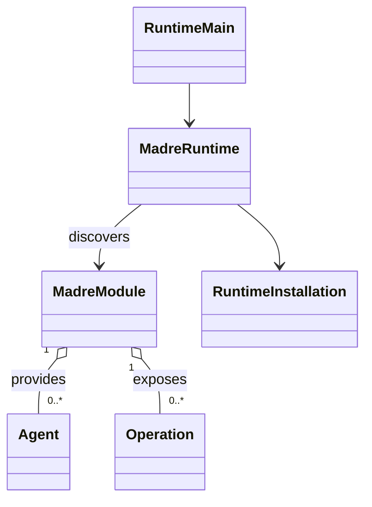

# Installed Runtime base

This is the implemented foundation for Owner-led SDK architecture work. It installs Java Modules in one JVM and exposes their live presence. It does not define Agent or Operation behavior.

The accepted Module, Agent, and Operation relationship is drawn in [`mid-level-architecture.md`](mid-level-architecture.md#2-module-boundary). The implemented shape is deliberately smaller:

## Public entry

An independently built Java 21 JAR implements `io.github.didacll.madre.sdk.MadreModule` and lists its implementation class in `META-INF/services/io.github.didacll.madre.sdk.MadreModule`. The JAR needs only `madre-sdk` at compile time. One JAR supplies one Module. The Module provides a stable installation-local `id()` and may expose `Agent` and `Operation` instances. Those two SDK interfaces intentionally have no members yet: the Owner will establish their semantic contracts before execution is added.

## Installation and inspection

`madre-runtime` stages JARs in `<installation>/artifacts`, discovers the service entry from each staged JAR, and reports available Modules and the number of exposed Agents and Operations. Discovery errors are visible with the artifact name. Each JAR gets its own Java class loader, which is closed when the Runtime closes or refreshes discovery. This is same-JVM loading; it offers no process isolation or forced shutdown of uncooperative Module code.

`<installation>/runtime.properties` is owner-editable. `role.core` records the Module identity assigned the CORE role; assignment requires a currently available Module. The role does not instantiate special CORE logic, and a removed Module leaves its assignment visible as unavailable. `kernel.endpoint` selects a physical Kernel endpoint. Engine inspection delegates to the existing `madre-kernel-client`; it does not interpret physical descriptors as semantic assurances.

The local command entry is `io.github.didacll.madre.runtime.RuntimeMain` with an installation directory followed by `init`, `install JAR`, `artifacts`, `remove JAR-NAME`, `modules`, `assign-core MODULE-ID`, `kernel-endpoint [ENDPOINT]`, or `engines`. The Gradle `:madre-runtime:run` task can launch it with arguments. Module authors use the SDK rather than Runtime implementation classes.

## Deliberate limit

There is no Operation invocation, Agent delegation, reasoning conversion, semantic store, or delayed continuation in this slice. The initial types carry no invented SPIRA tuple, continuation object, CORE implementation, or application path policy. The next SDK work can define those contracts from Owner meaning without adapting to placeholder execution behavior.
