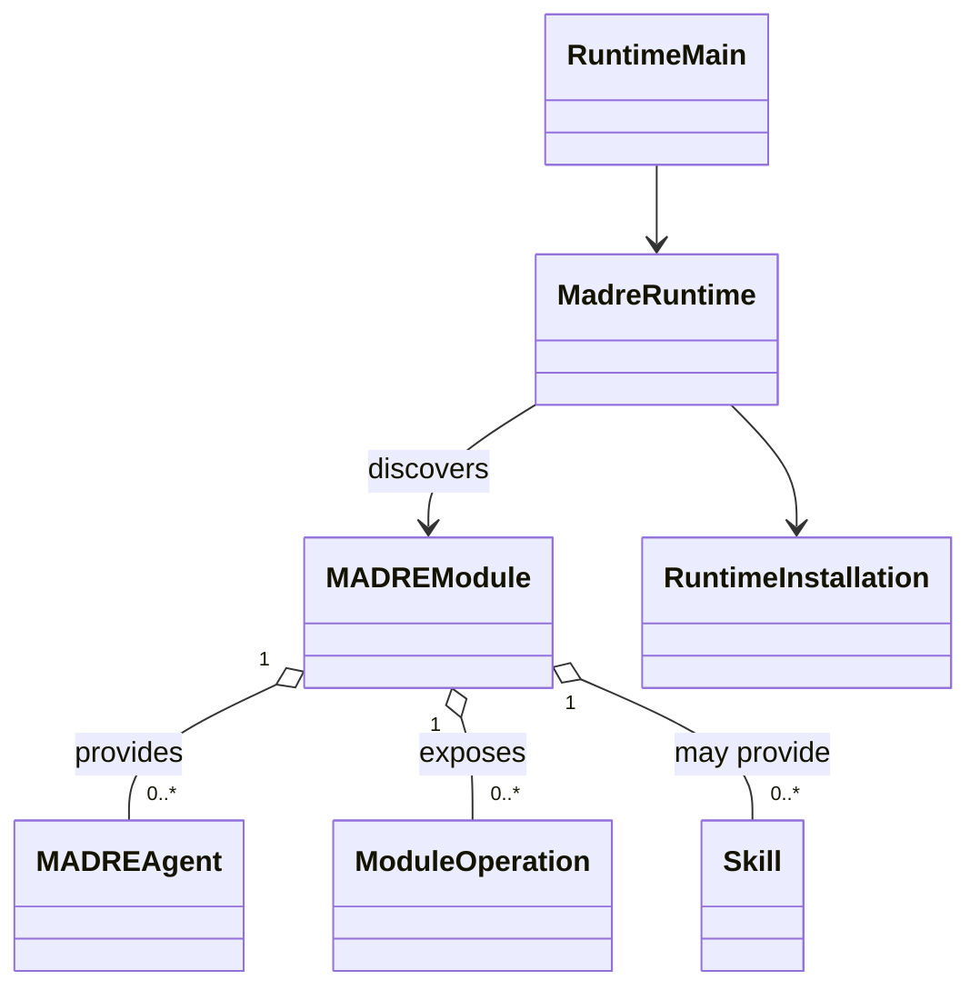

# Installed Runtime base

This is the implemented Module launcher and MADRE loop base for Owner-led SDK architecture work. It installs Java Modules in one JVM, exposes their live presence, and runs Module-posted code. It does not interpret Agent or Operation behavior.

The accepted Module, Agent, and Operation relationship is drawn in [`mid-level-architecture.md`](mid-level-architecture.md#2-module-boundary). The implemented shape is deliberately smaller:

## Public entry

An independently built Java 21 JAR implements `io.github.didacll.madre.sdk.MADREModule` and lists its implementation class in `META-INF/services/io.github.didacll.madre.sdk.MADREModule`. The JAR needs only `madre-sdk` at compile time. One JAR supplies one Module. The Module provides a stable installation-local `id()` and may expose `MADREAgent`, `ModuleOperation`, and `Skill` instances. The SDK's accepted semantic vocabulary and open contracts are recorded in [`madre-sdk/README.md`](../../madre-sdk/README.md).

## Installation and inspection

`madre-runtime` stages JARs in `<installation>/artifacts`, discovers the service entry from each staged JAR, and reports available Modules with their exposed Agent and Operation IDs. Those IDs are local to the providing Module. Discovery errors are visible with the artifact name. Each JAR gets its own Java class loader over a disposable Runtime copy, so the installed JAR can be removed while the Module is live on Windows. On shutdown or removal, Runtime calls that Module's `close()` before closing its loader. Adding or removing another artifact does not restart unrelated Modules. This is same-JVM loading; it offers no process isolation or forced shutdown of uncooperative Module code.

`<installation>/runtime.properties` is owner-editable. `role.core` records the Module identity assigned the CORE role; an unavailable assignment remains visible. The role does not instantiate special CORE logic. The Runtime has no Kernel client dependency or Kernel configuration.

The local command entry is `io.github.didacll.madre.runtime.RuntimeMain` with an installation directory followed by `init`, `install JAR`, `artifacts`, `remove JAR-NAME`, `modules`, `assign-core MODULE-ID`, or `serve`. `serve` keeps the installation active, discovers artifact changes, and executes Module-posted actions. Installation commands do not start another copy of the live Runtime. The Gradle `:madre-runtime:run` task can launch it with arguments. Module authors use the SDK rather than Runtime implementation classes.

Each Module receives a stable `<installation>/module-data` directory through the public SDK; Runtime does not inspect or migrate its contents. A Module can post its own `Runnable` through `ModuleEnvironment.post`. Runtime runs one posted action at a time, reports the last thrown runtime failure, and drops queued actions from an unloaded Module. Posts are in-memory and do not claim durable scheduling or recovery. Only one live Runtime may open an installation at a time.

## Deliberate limit

There is no Operation invocation, Agent delegation, reasoning conversion, or inference correlation in this slice. The MADRE loop runs Module-owned code without becoming the owner of a WorkPlan or Agent continuation. The types carry no invented SPIRA tuple, continuation object, or CORE implementation. The next SDK work can define semantic calls from Owner meaning without adapting to placeholder execution behavior.
