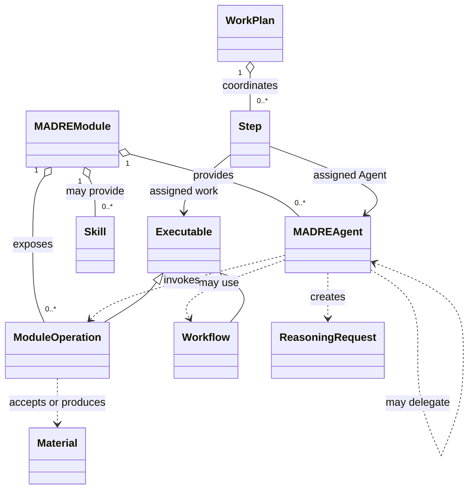

# Public SDK development base

This package names the accepted semantic pieces for independent Modules. It is a development base, not an executable Agent framework. The [Owner Intent Corpus](../docs/product/owner-intent-corpus.md), [SPIRA architecture](../docs/architecture/security-algebra.md), and [mid-level architecture](../docs/architecture/mid-level-architecture.md) govern their meaning.

`Material.sensitivity()`, `MADREAgent.integrity()`, and `ModuleOperation.risk()` put three settled SPIRA facts on their direct semantic carriers. The five enums preserve the accepted 0–5 order. Privacy belongs to the actual receiving boundary, including an Operation's accepted Material boundary; Autonomy belongs to the current acting Agent continuation. Neither is placed permanently on the Agent, Operation, Module, or ReasoningRequest. No Compound, EffectProfile, authorization service, or five-field request label is introduced.

Skill and ReasoningRequest are named without invented state or lifecycle methods. A WorkPlan exposes its steps, with an Agent assigned to each Step and an Operation or Workflow as its Executable. Workflow remains a result-dependent graph; its Java graph and invocation methods are not yet defined. The SDK types do not require a Module to expose any Agent or Skill. A Module can expose an Operation while remaining agentless. Module-owned domain types, persistence, UI, integrations, Agent behavior, and WorkPlan state remain its own.

The TODOs mark Java contracts still requiring Owner-led design: Material input/output boundary shape, Operation invocation, explicit Agent delegation, current continuation representation, ReasoningRequest construction, execution preferences, and the Module-owned reasoning-to-physical function. No SDK type constructs Kernel Work or depends on `madre-kernel-client`.
