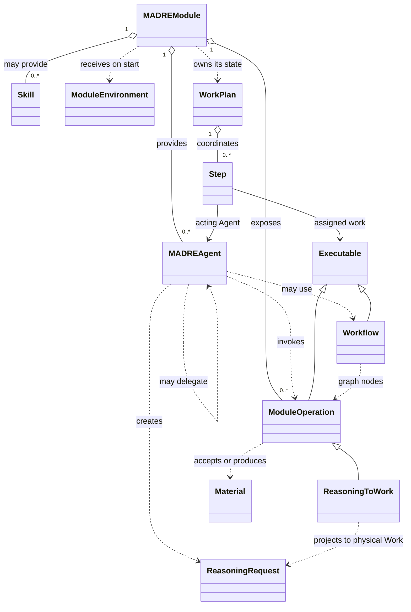

# Public SDK development base

This package names the accepted semantic pieces for independent Modules. It is a development base, not an executable Agent framework. The [Owner Intent Corpus](../docs/product/owner-intent-corpus.md), [SPIRA architecture](../docs/architecture/security-algebra.md), and [mid-level architecture](../docs/architecture/mid-level-architecture.md) govern their meaning.

The five enums preserve the accepted 0–5 order. SPIRA values are results obtained for the actual constituents by domain logic and composed algebraically; they are not fields or labels attached to SDK objects. Privacy describes the actual receiving surface, including an Operation's accepted Material boundary; Autonomy describes the current acting Agent continuation. No Compound, EffectProfile, authorization service, or five-field request label is introduced.

Skill and ReasoningRequest remain open semantic types. Workflow represents a result-dependent graph of Operations. A WorkPlan's implementation and inter-Module state belong to its owning Module; its steps bind an Agent to an Executable, which can be an Operation or Workflow. A Module may own a UI that interacts with an Agent without making that UI a universal SDK type. Explicit Agent delegation crosses Modules through Runtime transport; invoking an Operation leaves the initiating Agent as actor. The SDK types do not require a Module to expose any Agent, UI, or Skill. Module-owned domain types, persistence, integrations, and Agent behavior remain its own.

`ReasoningToWork` is the installation-selected, Module-implemented Operation for the semantic request to physical requirement translation. It has no frozen Java invocation method yet: the execution-preference/declaration shape remains open. Other domain strategies, including SPIRA demonstrations and Material transformations, belong to their Modules; no strategy registry or facet object is imposed on them.

The TODOs mark Java contracts still requiring Owner-led design: Material input/output boundary shape, Operation invocation, explicit Agent delegation, current continuation representation, ReasoningRequest construction, execution preferences, and the precise reasoning-to-physical call. No SDK type constructs Kernel Work or depends on `madre-kernel-client`.

An installed Module receives a `ModuleEnvironment` in `start`. Its data directory is stable across Runtime restarts and belongs to the Module. `schedule` stores a due time and an opaque Module reference; `onWakeup` receives the same delivery ID until it returns successfully. The Module must make its own handling durable and idempotent before returning. This wakeup is timing and delivery support, not an Operation execution or a Runtime-owned WorkPlan.
